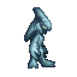
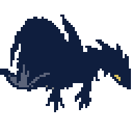
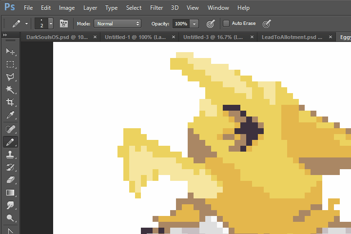
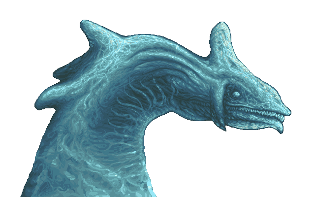
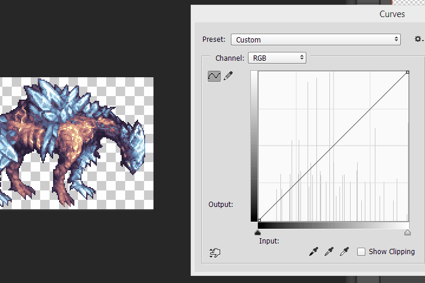
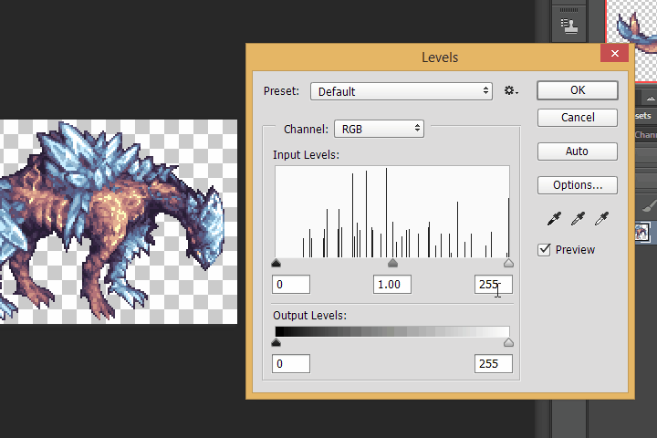
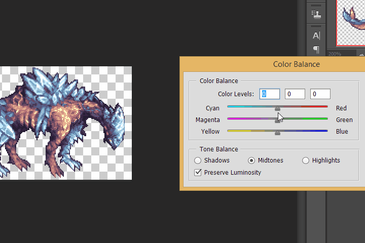
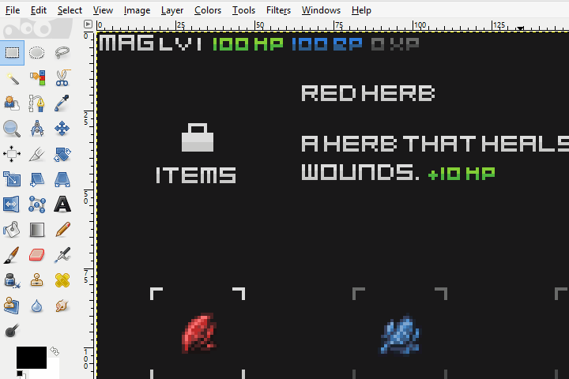
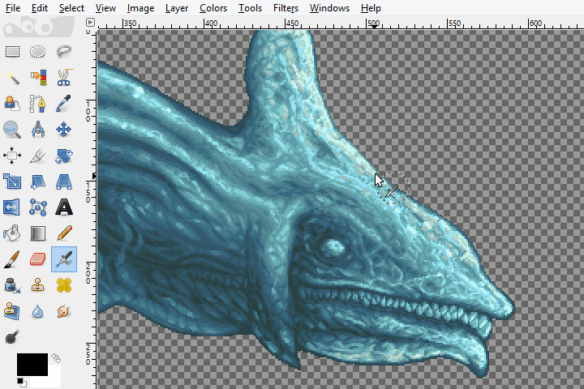

Pixel art is a part of the legacy of game development, all early games were pixel art.

Pokemon had pixel art in every game up until their X/Y series, Sonic's last pixel art game was Sonic Advance 3, Ragnarok Online tried to mix 3D and Pixel Art.

## Limitations & Guidelines

Colors have *4 channels*, **R**, **G**, **B**, and **Alpha** (transparency), and most modern devices use an 8 bit per channel (for a maximum of *256 possible brightness levels per channel*) for image files and displays. On old game consoles like the Gameboy, Super Nintendo, Genesis, and even the GBA, developers had to deal with tighter color requirements. The Gameboy only had *4 shades* to choose from, the Gameboy Color had a 5-bit (for a max of 32 possible brightness levels) per channel display, and could display a maximum of *56 colors*, though normally it was far less. Pixel art was born from these limitations.

In addition, older devices had limited amounts of ram. The Commodoore 64's resolution was *320 by 200 pixels*, and so if you wanted a *4 bit display*, you would need *4 bits* for every pixel (64,000) on the screen, for a grand total of *((64000 * 4)/8)/1000 = 32kb of ram*, which was often times more than the amount of ram in the entire computer!

In addition, on the Nes, sprites were very small images, so often times you would be limited by the size a sprite could be, constrained to a 8x8 grid. You could only have 64 of these sprites on a screen at any given time.

We're now free to use all 256^3 colors if we want, make pixel art at any size, but bear in mind restrictions are what makes pixel art distinct from other forms of art. Even to this day we have places like PixelJoint keeping these restrictions alive.

## Pixel Art Vs. Digital Paintings

**Pixel Art** is an image that was designed pixel by pixel.

It's different from other forms of art like digital painting or line art in that every pixel is important, whereas those forms of art avoid that level of precision.

## Palette

A **palette** is a color ramp, from low to high, and should be characterized by complex, hue shifting tones. You shouldn't have a pallette that's linear but rather, have one that mixes colors together.

Most artists start with an average color for the piece that they're doing, then add highlights and shadows to that.

A good idea is to use complementary colors to help blend colors together. Purple or Teal work well for shadows, whereas yellows and whites work for specular highlights.

It's best to have a maximum of 15 colors per sprite (with transparency being the 16th color).

## Silhouette

The lead cartoonist for Spongebob Squarepants, Sherm Cohen, suggested that silhouettes should communicate the idea of a character's action. This applies not only to animation, but also to all forms of art, including pixel art, the silhouette is what makes or breaks a piece.

You want your silhouette to be solid, with no jagged lines, and would paint on top of that silhouette.

One technique to make this easier is to use **Layer masks**, in Photoshop, this is done by *Layer > Layer Mask > From Transparency*. This will make painting easier by letting you draw strokes without worrying about the silhouette you worked so hard on.

## Anti-Aliasing and Readability

Since pixel art is normally small, it can become difficult to communicate intricate details within a small space, so an artist is fighting between anti-aliasing and readability.

**Anti-Aliasing** is the process of making edges smoother by blending them with their surrounding pixels.

**Readability** is how easily you can distinguish details in an image. Generally, The more anti-aliased an image, the less readable it is.

One way to improve readability is to add **outlines** to your sprite. That's not always a good idea, such as for environments, but for characters and objects, outlines are a great stylistic choice.

## Shading

**Dithering** is to gradate colors together via a pattern. Generally you want to avoid mechanical dithering and op for a pattern based effect instead.

In this sprite of Perfect Chaos from Sonic Adventure DX, I dithered the image with intricate water simulation. Proper anti-aliasing and careful shapes and edges made the water look almost photo-realistic.

## Post-Processing

Often times your original choice of colors wasn't the best one, so post-processing could serve as a way to correct your colors and make them stand out.

**Curves** - The curve tool is a method of adjusting the ratio of colors on an image. On Photoshop this can be found at *Image > Adjustments > Curves*, and on Gimp at *Colors > Curves*.

**Levels** - The levels tool is a simple method of adjusting the brightness of colors. The **middle handle** adjust the mid color balance, the **left handle** adjusts the darks, the **right handle** adjusts the highlights. Curves and levels are interchangeable so use whichever you prefer.

**Color Balance** - A method of changing the general tonalities of an image. Movie makers often adjust the color balance to have cyan shadows and red orange highlights. Look at any movie and notice just how blue it is!

**Color Replacement** - Sometimes what you really need is to manually replace colors. You can do this by using the color selection tool in Gimp (There's no equivalent functionality in photoshop), just click the icon with a hand and a blue, red, and green square, set your threshold to 0, and select the colors you want to replace. Then use the fill tool and fill the whole selection.

To measure the number of colors on your sprite, you can use a tool like Gimp's **Colorcube Analysis**.
