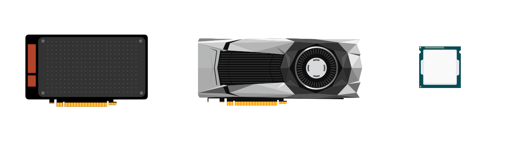
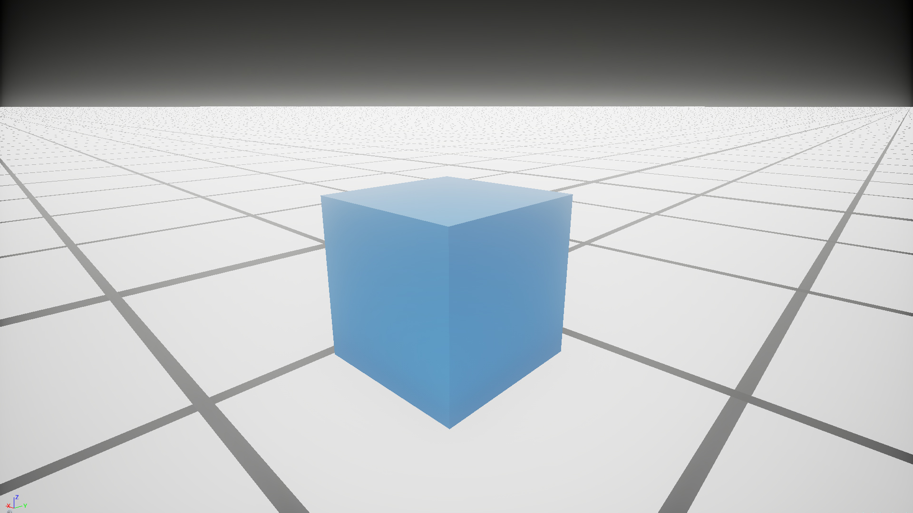
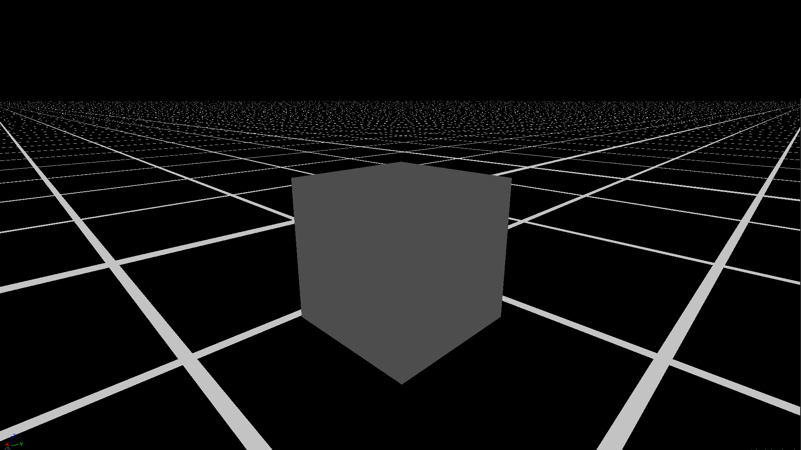
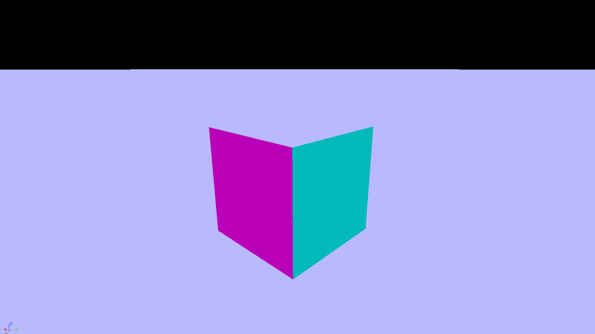
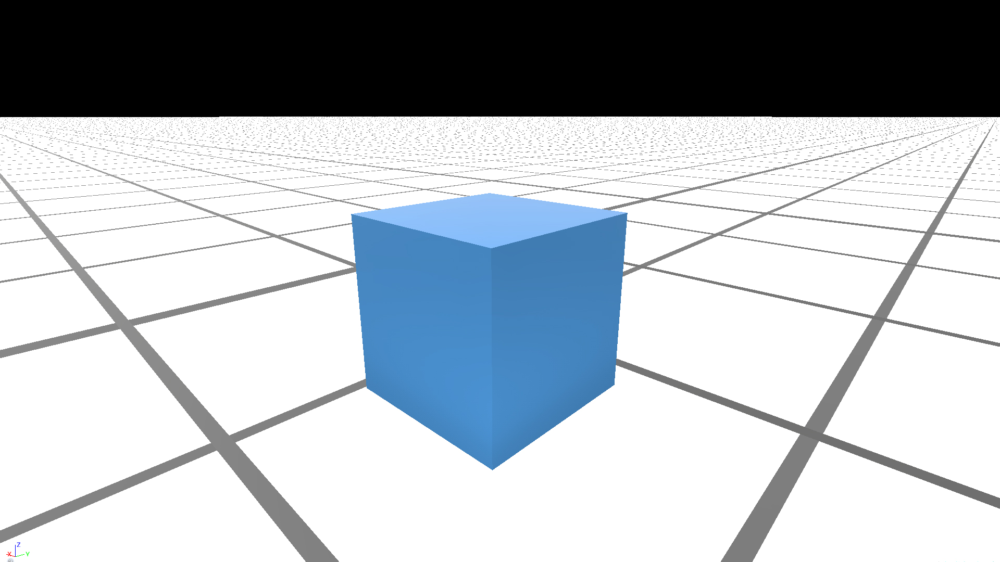
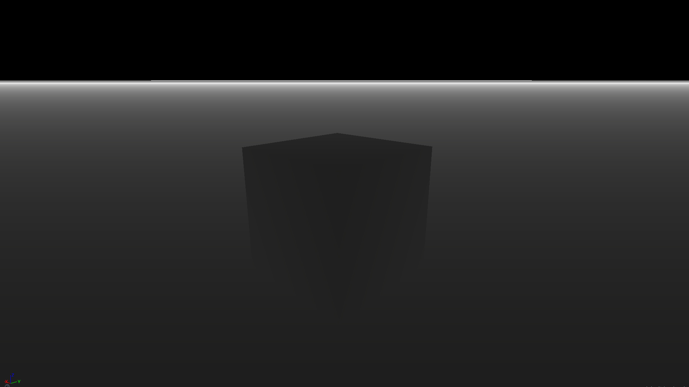

Vulkan is a new low level Graphics API released February 2016 by the [Khronos Group](https://khronos.org) that maps directly to the design of modern GPUs. GPUs were originally simple ASICs, but since then they have become programmable computational units of their own with a focus on throughput over latency. Older APIs like OpenGL or DirectX were designed for hardware that's drastically changed since the early 90s when they were first released, so Vulkan was designed from scratch to match the way GPUs are engineered today.


Currently Vulkan 1.0.x supports the following platforms:

- Windows
- Linux
- Android
- iOS (w/ [MoltenVK](https://moltengl.com/moltenvk/))
- Mac OS (w/ [MoltenVK](https://moltengl.com/moltenvk/))
- Nintendo Switch
- [And many more!](https://www.khronos.org/conformance/adopters/conformant-products)

And languages such as:

- [C](https://vulkan.lunarg.com/) - The official language for Vulkan.

- [C++](https://github.com/khronosgroup/vulkan-hpp) - Through [**Vulkan-Hpp**](https://github.com/KhronosGroup/Vulkan-Hpp) the official Vulkan C++ library.

- [Rust](https://github.com/tomaka/vulkano) - Through [**Vulkano**](https://github.com/tomaka/vulkano), an intuitive Rust wrapper with a heavy focus on compile time safety.

- [Python](https://github.com/bglgwyng/pyVulkan) - Through [**pyVulkan**](https://github.com/bglgwyng/pyVulkan), a Python FFI to the C implementation of Vulkan.

With Vulkan you'll be able to do:

1. Realtime Rendering - 

2. Machine Learning - Vulkan features a compute pipeline to make it easy to perform GPGPU intensive tasks like machine learning.

I've prepared a [Github Repo](http://github.com/alaingalvan/raw-vulkan) with all the code we'll be going over; We're going to walk through writing the simplest Vulkan app possible, a program that *creates* a triangle, *processes* it with a shader, and *displays* it on a window.

By the end of this post you should know every Vulkan construct needed to render a triangle, and will be able to use that knowledge to build libraries, demos, games, and apps. 

---

## Setup

First install [Conan](https://www.conan.io/downloads), A C++ package manager as easy to use as `npm`, then type the following in your [terminal](https://hyper.is/).

```bash
# 📋 Clone the starter repo
git clone https://github.com/alaingalvan/raw-vulkan
cd raw-vulkan/1-hello-triangle/cpp

# ⬇️ Install dependencies
conan install

# 🔨 Compiles your shaders, & then compiles the app
conan build
```

### Dependencies

Conan handles downloading/installing all your dependencies, for this app we're using:

- [Vulkan SDK](https://vulkan.lunarg.com/) - The official Vulkan SDK distributed by LunarG.

- [Vulkan C++ API](https://github.com/KhronosGroup/Vulkan-Hpp) - C++ bindings that add compile time type safety and ease of use.

- [WSIWindow](https://github.com/renelindsay/Vulkan-WSIWindow) - LunarG's cross platform Window creation library.

- [GLM](http://glm.g-truc.net/0.9.8/index.html) - A C++ library that allows uses to write `glsl` like C++ code, with types for vectors, matrices, etc.

## Overview

In this application we will need to do the following:

1. *Create* a **Vulkan Instance** to access inner functions of the Vulkan API.

2. *Pick* the best **Physical Device** from every device that supports Vulkan on your machine.

3. *Create* a **Logical Device** from your physical device to interface with Vulkan.

4. *Create* **Window** using the WSIWindow library. This will also create a **Surface** for our application to use later. 

5. *Create* a **Swapchain** from your logical device. This will manage changing frames and hold the surface specific **Color Attachment**.

6. *Create* a **Depth Attachment** that will go into our render pass.

7. *Create* a set of **Frame Buffers** for each image in your swapchain.

8. *Create* a primary **Render Pass** to be used in your swapchain and surface. This will also let us group our depth and color attachments.

9. *Create* **Synchronization** primitives like semaphores to determine when we're finished presenting and finished rendering, and fences to check the start of the render loop, or to determine when memory has finished being written to.

10. *Create* a **Command Pool** from your logical device.

11. *Create* a **Vertex Buffer** and **Index Buffer** for your geometry. 

12. *Copy* to **GPU Local Memory** the data for your vertex, index, and uniform buffers.

13. *Load* **SPIR-V** shader binaries for our Vertex and Fragment shaders.

14. *Create* a **Graphics Pipeline** to represent the entire state of the Graphics Pipeline for that triangle.

15. *Create* **Commands** for each command buffer to set the GPU's state to render the triangles.

16. *Use* an **Update Loop** to switch between different frames in your swapchain as well as to poll input devices/window events.

## Instances


Similar to the OpenGL context, a Vulkan application begins when you create an **instance**. This instance must be loaded with some information about the program such as its name, engine, and minimum Vulkan version, as well any extensions and layers you want to load.

**Extension** - Anything that adds extra functionality to Vulkan, such as support for Win32 windows, or enabling drawing onto a target.

**Layer** - Middleware between existing Vulkan functionality, such as checking for errors. Layers can range from runtime debugging checks like LunarG's Standard Validation tools to hooks to the Steam renderer so your game can behave better when you `Ctrl + Shift` to switch to the Steam overlay.

You'll want to begin by determining which extensions/layers you want, and compare that with which are available to you by Vulkan.

```cpp
// 🔍 Find the best Instance Extensions

auto installedExtensions = vk::enumerateInstanceExtensionProperties();

std::vector<const char*> wantedExtensions =
{
  VK_EXT_DEBUG_REPORT_EXTENSION_NAME,
  VK_KHR_SURFACE_EXTENSION_NAME,
  VK_KHR_WIN32_SURFACE_EXTENSION_NAME
};

auto extensions = std::vector<const char*>();

for (auto &w : wantedExtensions) {
  for (auto &i : installedExtensions) {
    if (std::string(i.extensionName).compare(w) == 0) {
      extensions.emplace_back(w);
      break;
    }
  }
}

// 🔎 Find the best Instance Layers

auto installedLayers = vk::enumerateInstanceLayerProperties();

std::vector<const char*> wantedLayers =
{
  "VK_LAYER_LUNARG_standard_validation"
};

auto layers = std::vector<const char*>();

for (auto &w : wantedLayers) {
  for (auto &i : installedLayers) {
    if (std::string(i.layerName).compare(w) == 0) {
      layers.emplace_back(w);
      break;
    }
  }
}

// ⚪ Create an Instance

auto appInfo = vk::ApplicationInfo(
  "MyApp",
  VK_MAKE_VERSION(1, 0, 0),
  "MyAppEngine",
  VK_MAKE_VERSION(1, 0, 0),
  VK_API_VERSION_1_0
);

auto instance = vk::createInstance(
  vk::InstanceCreateInfo(
    vk::InstanceCreateFlags(),
    &appInfo,
    layers.size(),
    layers.data(),
    extensions.size(),
    extensions.data()
  )
);
```

## Physical Devices



In Vulkan, you have access to all enumerable devices that support it, and can query for information like their name, the number of heaps they support, their manufacturer, etc.

```cpp
// Initialize Devices
auto physicalDevices = instance.enumeratePhysicalDevices();
auto gpu = physicalDevices[0];
```

> **Note** - This is useful for choosing the fastest device to use, however you could use the upcoming `KHX_device_group` extension presented at [GDC 2017](https://www.khronos.org/assets/uploads/developers/library/2017-gdc/GDC_Vulkan-on-Desktop_Feb17.pdf) to help with multi-gpu processing.

## Logical Devices


You can then create a logical device from a physical device handle. A logical device can be loaded with its own extensions/layers, can be set to work with graphics, GPGPU computations, handle sparse memory and/or memory transfers by creating queues for that device.

A logical device is your interface to the GPU, and allows you to allocate data and queue up tasks.

```cpp
// 🔍 Find the best GPU Extensions

auto gpuExtensions = gpu.enumerateDeviceExtensionProperties();

std::vector<const char*> wantedDeviceExtensions =
{
  VK_KHR_SWAPCHAIN_EXTENSION_NAME,
  VK_EXT_DEBUG_MARKER_EXTENSION_NAME
};

auto deviceExtensions = std::vector<const char*>();

for (auto &w : wantedDeviceExtensions) {
  for (auto &i : gpuExtensions) {
    if (std::string(i.extensionName).compare(w) == 0) {
      deviceExtensions.emplace_back(w);
      break;
    }
  }
}

// 🔎 Find the best GPU Layer

auto gpuLayers = gpu.enumerateDeviceLayerProperties();

std::vector<const char*> wantedDeviceValidationLayers =
{
  "VK_LAYER_LUNARG_standard_validation"
};

auto deviceValidationLayers = std::vector<const char*>();

for (auto &w : wantedLayers) {
  for (auto &i : installedLayers) {
    if (std::string(i.layerName).compare(w) == 0) {
      layers.emplace_back(w);
      break;
    }
  }
}

// 🔍 Find the queues on that GPU that support graphics

auto formatProperties = gpu.getFormatProperties(vk::Format::eR8G8B8A8Unorm);
auto gpuFeatures = gpu.getFeatures();
auto gpuQueueProps = gpu.getQueueFamilyProperties();

float priority = 0.0;
uint32_t graphicsFamilyIndex = 0;
auto queueCreateInfos = std::vector<vk::DeviceQueueCreateInfo>();

for (auto& queuefamily : gpuQueueProps)
{
  if (queuefamily.queueFlags & vk::QueueFlagBits::eGraphics) {
    // Create a single graphics queue.
    queueCreateInfos.push_back(
      vk::DeviceQueueCreateInfo(
        vk::DeviceQueueCreateFlags(),
        graphicsFamilyIndex,
        1,
        &priority
      )
    );
    break;
  }

  graphicsFamilyIndex++;

}

// Create a device

auto device = gpu.createDevice(
  vk::DeviceCreateInfo(
    vk::DeviceCreateFlags(),
    queueCreateInfos.size(),
    queueCreateInfos.data(),
    deviceValidationLayers.size(),
    deviceValidationLayers.data(),
    deviceExtensions.size(),
    deviceExtensions.data(),
    &gpuFeatures
  )
);
```

## Queue


Once you have a virtual device, you can access the queues you requested when you created it:

```cpp
// We only allocated one queue earlier,
//so there's only one available on index 0.
auto graphicsQueue = device.getQueue(graphicsFamilyIndex, 0);
```

## Window Surface Interface


Each OS has their own specific window generation system, so Vulkan uses layers and platform specific adapters to interface with them.

A **surface** is an adapter abstraction to describe an area that will render Vulkan to a window, it's the binding between Vulkan and your OS's windowing system.

For the sake of simplicity, we'll let **WSIWindow** serve as a cross platform windowing API. 

```cpp
#include "WSIWindow.h"

// 💻📱 Create an OS agnostic window class

class MyWindow : public WSIWindow 
{
  //--Mouse event handler--
  void OnMouseEvent(eAction action, int16_t x, int16_t y, uint8_t btn)
  {
      const char* type[]={"up  ","down","move"};
      printf("Mouse: %s %d x %d Btn:%d\n",type[action],x,y,btn);
  }

  //--Keyboard event handler--
  void OnKeyEvent(eAction action,uint8_t keycode)
  {
      const char* type[]={"up  ","down"};
      printf("Key: %s keycode:%d\n",type[action],keycode);
  }

  //--Text typed event handler--
  void OnTextEvent(const char* str)
  {
      printf("Text: %s\n",str);
  }

  //--Window resize event handler--
  void OnResizeEvent(uint16_t width, uint16_t height)
  {
      printf("Window Resize: width=%4d height=%4d\n",width, height);
  }
};
```

Bear in mind, it's your responsibility to manage things like window size, canvas size (supersampling), DPI and retina support, nested windows, window management and spawning multiple windows.


## Color Formats

Knowing what Color formats your GPU supports will play a crucial role in determining what you can display and what kind of buffers you can allocate.

```cpp
// 🔴 Check to see if we can display rgb colors.
auto surfaceFormats = gpu.getSurfaceFormatsKHR(surface);

vk::Format surfaceColorFormat;
vk::ColorSpaceKHR surfaceColorSpace;

if (surfaceFormats.size() == 1 && surfaceFormats[0].format == vk::Format::eUndefined)
  surfaceColorFormat = vk::Format::eB8G8R8A8Unorm;
else
  surfaceColorFormat = surfaceFormats[0].format;

surfaceColorSpace = surfaceFormats[0].colorSpace;


auto formatProperties = gpu.getFormatProperties(vk::Format::eR8G8B8A8Unorm);

// 🔵 Find a suitable depth format to use, starting with the best format
std::vector<vk::Format> depthFormats = {
  vk::Format::eD32SfloatS8Uint,
  vk::Format::eD32Sfloat,
  vk::Format::eD24UnormS8Uint,
  vk::Format::eD16UnormS8Uint,
  vk::Format::eD16Unorm
};

vk::Format surfaceDepthFormat;

for (auto& format : depthFormats)
{
  auto depthFormatProperties = gpu.getFormatProperties(format);
  // Format must support depth stencil attachment for optimal tiling
  if (depthFormatProperties.optimalTilingFeatures & vk::FormatFeatureFlagBits::eDepthStencilAttachment)
  {
    surfaceDepthFormat = format;
    break;
  }
}
```

## Render Pass

|   | Unreal Engine 4 Render Passes |   |
|:-:|:-:|:-:|
|  |  |  |
|  |  |  |
For defered rendering solutions, Vulkan makes render passes first class, letting you describe your whole postprocessing system as a list of **SubPasses**, groupings of rendered data like a color and depth buffer.

- **Attachment Description** - a description of the image view that will be attached to the subpass.

- **Attachment Reference** - an index name to refer to the framebuffer attachment accessed by different subpasses.

- **Subpass** - A phase of rendering within a render pass, that reads and writes a subset of the attachments.

- **Subpass Dependency** - an execution or memory dependency between different subpasses. This would be for example, the `sampler2D` that you would access in a post-processing system that is waterfalled down the chain of effects. This list also determines the order that subpasses are used.

```cpp
// 📎 Create a list of what attachments will be in the output frame buffer
std::vector<vk::AttachmentDescription> attachmentDescriptions =
{
  vk::AttachmentDescription(
    vk::AttachmentDescriptionFlags(),
    surfaceColorFormat,
    vk::SampleCountFlagBits::e1,
    vk::AttachmentLoadOp::eClear,
    vk::AttachmentStoreOp::eStore,
    vk::AttachmentLoadOp::eDontCare,
    vk::AttachmentStoreOp::eDontCare,
    vk::ImageLayout::eUndefined,
    vk::ImageLayout::ePresentSrcKHR
  ),
  vk::AttachmentDescription(
    vk::AttachmentDescriptionFlags(),
    surfaceDepthFormat,
    vk::SampleCountFlagBits::e1,
    vk::AttachmentLoadOp::eClear,
    vk::AttachmentStoreOp::eDontCare,
    vk::AttachmentLoadOp::eDontCare,
    vk::AttachmentStoreOp::eDontCare,
    vk::ImageLayout::eUndefined,
    vk::ImageLayout::eDepthStencilAttachmentOptimal
  )
};

// 🌈 Create a list of what attachments are color based
std::vector<vk::AttachmentReference> colorReferences =
{
  vk::AttachmentReference(0, vk::ImageLayout::eColorAttachmentOptimal)
};

// 🌑 Create a list of what attachments are depth based
std::vector<vk::AttachmentReference> depthReferences = {
  vk::AttachmentReference(1, vk::ImageLayout::eDepthStencilAttachmentOptimal)
};

// 🔸 Create a subpass that targets the color references we listed above
std::vector<vk::SubpassDescription> subpasses =
{
  vk::SubpassDescription(
    vk::SubpassDescriptionFlags(),
    vk::PipelineBindPoint::eGraphics,
    0,
    nullptr,
    colorReferences.size(),
    colorReferences.data(),
    nullptr,
    depthReferences.data(),
    0,
    nullptr
  )
};

// 🖇️ Create a list of what subpasses can use what other subpasses
std::vector<vk::SubpassDependency> dependencies =
{
  vk::SubpassDependency(
    ~0U,
    0,
    vk::PipelineStageFlagBits::eBottomOfPipe,
    vk::PipelineStageFlagBits::eColorAttachmentOutput,
    vk::AccessFlagBits::eMemoryRead,
    vk::AccessFlagBits::eColorAttachmentRead | vk::AccessFlagBits::eColorAttachmentWrite,
    vk::DependencyFlagBits::eByRegion
  ),
  vk::SubpassDependency(
    0,
    ~0U,
    vk::PipelineStageFlagBits::eColorAttachmentOutput,
    vk::PipelineStageFlagBits::eBottomOfPipe,
    vk::AccessFlagBits::eColorAttachmentRead | vk::AccessFlagBits::eColorAttachmentWrite,
    vk::AccessFlagBits::eMemoryRead,
    vk::DependencyFlagBits::eByRegion
  )
};

// 🈴 Create a render pass with the attachments / subpasses we want.
auto renderpass = device.createRenderPass(
  vk::RenderPassCreateInfo(
    vk::RenderPassCreateFlags(),
    attachmentDescriptions.size(),
    attachmentDescriptions.data(),
    subpasses.size(),
    subpasses.data(),
    dependencies.size(),
    dependencies.data()
  )
);
```


## Swapchain


A **Swapchain** is a structure that manages the allocation of frame buffers to be cycled through by your application. It's here that your application sets up V-Sync via double buffering or triple buffering.

> One approach to setting this up is to take in a JSON file at the start of your application, say `config.json`, which determines if you'll be using V-Sync, your screen resolution, any any other global data you want to configure.

```cpp
auto surfaceCapabilities = gpu.getSurfaceCapabilitiesKHR(surface);
auto surfacePresentModes = gpu.getSurfacePresentModesKHR(surface);

// check the surface width/height.
if (!(surfaceCapabilities.currentExtent.width == -1 || surfaceCapabilities.currentExtent.height == -1)) {
  surfaceSize = surfaceCapabilities.currentExtent;
}

auto presentMode = vk::PresentModeKHR::eImmediate;

for (auto& pm : surfacePresentModes) {
  if (pm == vk::PresentModeKHR::eMailbox) {
    presentMode = vk::PresentModeKHR::eMailbox;
    break;
  }
}

assert(surfaceCapabilities.maxImageCount >= 3);
auto swapchainCreateInfo = vk::SwapchainCreateInfoKHR();
swapchainCreateInfo.surface = surface;
swapchainCreateInfo.minImageCount = 3;
swapchainCreateInfo.imageFormat = colorFormat;
swapchainCreateInfo.imageColorSpace = colorSpace;
swapchainCreateInfo.imageExtent = surfaceSize;
swapchainCreateInfo.imageArrayLayers = 1;
swapchainCreateInfo.imageUsage = vk::ImageUsageFlagBits::eColorAttachment;
swapchainCreateInfo.imageSharingMode = vk::SharingMode::eExclusive;

std::vector<uint32_t> queueFamilyIdices;
queueFamilyIdices.push_back(graphicsFamilyIndex);

swapchainCreateInfo.queueFamilyIndexCount = queueFamilyIdices.size();
swapchainCreateInfo.pQueueFamilyIndices = queueFamilyIdices.data();
swapchainCreateInfo.preTransform = vk::SurfaceTransformFlagBitsKHR::eIdentity;
swapchainCreateInfo.compositeAlpha = vk::CompositeAlphaFlagBitsKHR::eOpaque;
swapchainCreateInfo.presentMode = presentMode;

auto swapchain = device.createSwapchainKHR(swapchainCreateInfo);
auto swapchainImages = device.getSwapchainImagesKHR(swapchain);
```

## View Structures

A **View** in Vulkan is a handle to a particular resource on a GPU, such as an Image or a Buffer, and provides information on how that resource should be processed.

```cpp
auto depthImageView = device.createImageView(
  vk::ImageViewCreateInfo(
    vk::ImageViewCreateFlags(),
    depthImage,
    vk::ImageViewType::e2D,
    surfaceDepthFormat,
    vk::ComponentMapping(),
    vk::ImageSubresourceRange(
      vk::ImageAspectFlagBits::eDepth | vk::ImageAspectFlagBits::eStencil,
      0,
      1,
      0,
      1
    )
  )
);
```

They're use for example, in the creation of Frame Buffers, but can also be used in descriptor sets to denote a texture resource,


## Frame Buffers


A frame buffer in Vulkan is a container of Image Views.

```cpp
// The swapchain handles allocating frame images.
auto swapchainImages = device.getSwapchainImagesKHR(swapchain);

// Create Depth Image Data
auto depthImage = device.createImage(
  vk::ImageCreateInfo(
    vk::ImageCreateFlags(),
    vk::ImageType::e2D,
    surfaceDepthFormat,
    vk::Extent3D(surfaceSize.width, surfaceSize.height, 1),
    1,
    1,
    vk::SampleCountFlagBits::e1,
    vk::ImageTiling::eOptimal,
    vk::ImageUsageFlagBits::eDepthStencilAttachment | vk::ImageUsageFlagBits::eTransferSrc,
    vk::SharingMode::eExclusive,
    queueFamilyIndices.size(),
    queueFamilyIndices.data(),
    vk::ImageLayout::eUndefined
  )
);

// Search through GPU memory properies to see if this can be device local.

auto depthMemoryReq = device.getImageMemoryRequirements(depthImage);
uint32_t typeBits = depthMemoryReq.memoryTypeBits;
uint32_t depthMemoryTypeIndex;

for (uint32_t i = 0; i < gpuMemoryProps.memoryTypeCount; i++)
{
  if ((typeBits & 1) == 1)
  {
    if ((gpuMemoryProps.memoryTypes[i].propertyFlags & vk::MemoryPropertyFlagBits::eDeviceLocal) == vk::MemoryPropertyFlagBits::eDeviceLocal)
    {
      depthMemoryTypeIndex = i;
      break;
    }
  }
  typeBits >>= 1;
}

auto depthMemory = device.allocateMemory(
  vk::MemoryAllocateInfo(depthMemoryReq.size, depthMemoryTypeIndex)
);


device.bindImageMemory(
  depthImage,
  depthMemory,
  0
);

auto depthImageView = device.createImageView(
  vk::ImageViewCreateInfo(
    vk::ImageViewCreateFlags(),
    depthImage,
    vk::ImageViewType::e2D,
    surfaceDepthFormat,
    vk::ComponentMapping(),
    vk::ImageSubresourceRange(
      vk::ImageAspectFlagBits::eDepth | vk::ImageAspectFlagBits::eStencil,
      0,
      1,
      0,
      1
    )
  )
);

struct SwapChainBuffer {
  vk::Image image;
  std::array<vk::ImageView, 2> views;
  vk::Framebuffer frameBuffer;
};

std::vector<SwapChainBuffer> swapchainBuffers;
swapchainBuffers.resize(swapchainImages.size());

for (int i = 0; i < swapchainImages.size(); i++)
{
  swapchainBuffers[i].image = swapchainImages[i];

  // Color
  swapchainBuffers[i].views[0] =
    device.createImageView(
      vk::ImageViewCreateInfo(
        vk::ImageViewCreateFlags(),
        swapchainImages[i],
        vk::ImageViewType::e1D,
        surfaceColorFormat,
        vk::ComponentMapping(),
        vk::ImageSubresourceRange(
          vk::ImageAspectFlagBits::eColor,
          0,
          1,
          0,
          1
        )
      )
    );

  // Depth
  swapchainBuffers[i].views[1] = depthImageView;

  swapchainBuffers[i].frameBuffer = device.createFramebuffer(
    vk::FramebufferCreateInfo(
      vk::FramebufferCreateFlags(),
      renderpass,
      swapchainBuffers[i].views.size(),
      swapchainBuffers[i].views.data(),
      surfaceSize.width,
      surfaceSize.height,
      1
    )
  );
}
```


## Synchronization


Vulkan was designed with concurrency in mind, so you're free to use mutexes, and built in Vulkan Semaphores and Fences for GPU level Synchronization.

Semaphores coordinate operations within the graphics queue and ensure correct command ordering.

```cpp
// 🎌 Semaphore used to ensures that image presentation is complete before starting to submit again
auto presentCompleteSemaphore = device.createSemaphore(vk::SemaphoreCreateInfo());

// 🎌 Semaphore used to ensures that all commands submitted have been finished before submitting the image to the queue
auto renderCompleteSemaphore = device.createSemaphore(vk::SemaphoreCreateInfo());

// 🚧 Fence for command buffer completion
std::vector<vk::Fence> waitFences;
waitFences.resize(swapchainBuffers.size());
for (int i = 0; i < waitFences.size(); i++)
{
  waitFences[i] = device.createFence(vk::FenceCreateInfo(vk::FenceCreateFlagBits::eSignaled));
}
```

## Command Pool


A **command pool** is a means of allocating command buffers. Any number of command buffers can be made from command pools, with you as the developer responsible for managing when and how they're created and what is loaded in each.

A command pool cannot be used in multiple threads, but you can create one for each thread and manage them on a per thread level.

```cpp
// 🏊 Create a command pool

auto commandPoolInfo = vk::CommandPoolCreateInfo(
  vk::CommandPoolCreateFlags(vk::CommandPoolCreateFlagBits::eResetCommandBuffer),
  graphicsFamilyIndex
);
auto commandPool = device.createCommandPool(commandPoolInfo);

// Lets allocate 1 command buffer for each swapchain image.
auto commandBuffers = device.allocateCommandBuffers(
  vk::CommandBufferAllocateInfo(
    commandPool,
    vk::CommandBufferLevel::ePrimary,
    swapchainBuffers.size()
  )
);
```

You should try to have the minimum number of command buffers possible in your application.

> One possible setup could be taking a flat collection of renderable objects (like a scene), distributing it across as many threads as the computer's CPU allows, allocating a command buffer for each object, creating a pipeline for each object, and finishing by sending a ending buffer to start up the process.

We'll come back to the command buffers we made here later in our app.

## Descriptor Pool


A descriptor pool is a means of allocating Descriptor Sets, a set of data structures containing implementation-specific descriptions of resources. to make a descriptor pool, you need to describe exactly how many of each type of descriptor you need to allocate.

To do that you need to provide a collection of the size of each descriptor type.

```cpp
std::vector<vk::DescriptorPoolSize> descriptorPoolSizes =
{
  vk::DescriptorPoolSize(
  vk::DescriptorType::eUniformBuffer,
  1
  )
};

auto descriptorPool = device.createDescriptorPool(
  vk::DescriptorPoolCreateInfo(
    vk::DescriptorPoolCreateFlags(),
    1,
    descriptorPoolSizes.size(),
    descriptorPoolSizes.data()
  )
);
```

Like command buffers, we'll come back to descriptor sets later.

## Vertex Buffers

The fundamental problem of graphics is how to manage large sets of data. A vertex buffer is an array of rows of relevant vertex information, such as its position, normal, color, etc. Unlike OpenGL where it would handle allocation and handling memory for you, in Vulkan, you must:

1. allocate all the memory related to your buffer.
2. Map that data to a host visible handle.
3. Copy that data to your GPU.
4. Bind your buffer to that block of memory.

## Descriptor Sets


**Descriptor Sets** store the resources bound to the binding points in a shader. It connects the binding points of a shader with the buffers and images used for those bindings.

In React Fiber there's the idea of a frequently updated view and a not frequently updated view. Unreal Engine 4 shares this with two global uniform families for frequently (called variable parameters) and not frequently (constant parameters) updated uniforms. Descriptor Sets are where you would make this distinction in Vulkan.

```cpp
// Binding 0: Uniform buffer (Vertex shader)
std::vector<vk::DescriptorSetLayoutBinding> descriptorSetLayoutBindings =
{
  vk::DescriptorSetLayoutBinding(
    0,
    vk::DescriptorType::eUniformBuffer,
    1,
    vk::ShaderStageFlagBits::eVertex,
    nullptr
  )
};

std::vector<vk::DescriptorSetLayout> descriptorSetLayouts = {
  device.createDescriptorSetLayout(
    vk::DescriptorSetLayoutCreateInfo(
      vk::DescriptorSetLayoutCreateFlags(),
      descriptorSetLayoutBindings.size(),
      descriptorSetLayoutBindings.data()
  )
  )
};

auto descriptorSets = device.allocateDescriptorSets(
  vk::DescriptorSetAllocateInfo(
    descriptorPool,
    descriptorSetLayouts.size(),
    descriptorSetLayouts.data()
  )
);
```

## Pipeline Layouts

Pipeline layouts are a collection of descriptor sets, the bindings to a shader program. In OpenGL in order to bind a shader to a set of data, you needed to describe how the inputs and outputs are organized in memory (their spacing, size, etc.)

Access to descriptor sets from a pipeline is accomplished through a pipeline layout. Zero or more descriptor set layouts and zero or more push constant ranges are combined to form a pipeline layout object which describes the complete set of resources that can be accessed by a pipeline. The pipeline layout represents a sequence of descriptor sets with each having a specific layout. This sequence of layouts is used to determine the interface between shader stages and shader resources. Each pipeline is created using a pipeline layout.

## Pipeline State Objects


Pipelines are basically a mix of hardware and software functions that do a particular task on the GPU, in Vulkan, there's 2 types:

- Graphics Pipelines
- Compute Pipelines

### Graphics Pipeline


- **Color Blending** - The function that controls how two objects draw on top of each other.

- **Depth Stencil** - A extra piece of information that describes depth information.

- **Vertex Input** - The actual vertex data you'll be using in your shader.

- **Shaders** - What shaders will be loaded in.

And many more. These can even be cached! These particular draw calls are grouped such that in older graphics APIs, they would trigger shader recompilation.

### Pipeline Cache

A pipeline cache serves to cache previously created pipelines for reuse later. Since pipelines don't change often, this you can quickly create another for use later.

```cpp
auto pipelineCache = device.createPipelineCache(vk::PipelineCacheCreateInfo());
```

You're even able to compile the pipeline down into *binary*, and write the pipeline to a a file. This is part of the reason why DOOM 2016 takes a while to first start up when running it on Vulkan. [^vulkananddoom]

### Dynamic State Objects

Any fast changes of state will happen in the dynamic state objects.

### Shaders

Shaders must be passed to Vulkan as SPIR-V binary, so any compiler that can make SPIR-V is allowed. Shaders are precompiled, loaded into memory, transferred to a shader module, bundled in a set of pipelineShaderStages, which is then put into a graphics pipeline.

Shaders are compiled using the `glslangvalidator` bundled with the Vulkan SDK provided by LunarG.

```bash
glslangvalidator -V shader.vert -o shader.vert.spv
glslangvalidator -V shader.frag -o shader.frag.spv
```

Vulkan's GLSL code is the same as OpenGL 4.5:

```glsl
// Vertex Shader
#version 450

#extension GL_ARB_separate_shader_objects : enable
#extension GL_ARB_shading_language_420pack : enable

// Uniforms now come in the form of input layouts
layout (location = 0) in vec3 inPos;
layout (location = 1) in vec3 inColor;

layout (binding = 0) uniform UBO
{
  mat4 projectionMatrix;
  mat4 modelMatrix;
  mat4 viewMatrix;
} ubo;

layout (location = 0) out vec3 outColor;

out gl_PerVertex
{
  vec4 gl_Position;
};


void main()
{
  outColor = inColor;
  gl_Position = ubo.projectionMatrix * ubo.viewMatrix * ubo.modelMatrix * vec4(inPos.xyz, 1.0);
}
```

```glsl
// Fragment Shader
#version 450

#extension GL_ARB_separate_shader_objects : enable
#extension GL_ARB_shading_language_420pack : enable

layout (location = 0) in vec3 inColor;

layout (location = 0) out vec4 outFragColor;

void main()
{
  outFragColor = vec4(inColor, 1.0);
}
```

Shaders are loaded into **Pipeline Layouts** which are then executed by a command buffer.

```cpp
// 📈 Create your shader module handles

auto vertModule = device.createShaderModule(
  vk::ShaderModuleCreateInfo(
    vk::ShaderModuleCreateFlags(),
    vertexShader.size(),
    vertexShader.data()
  )
);

auto fragModule = device.createShaderModule(
  vk::ShaderModuleCreateInfo(
    vk::ShaderModuleCreateFlags(),
    fragShader.size(),
    fragShader.data()
    )
);
```

## Command Buffer


A **command buffer** is a container of GPU commands, this is where you would see commands similar to OpenGL's state commands:

- `setViewport`
- `setSissor`
- `blitImage`
- `bindPipeline`

A common pattern for building a command buffer is:

1. Start Render Pass
2. Bind Resources
    1. Descriptor Sets
    2. Vertex and Index Buffers
    3. Pipeline State
3. Modify Dynamic State
4. Draw
5. Repeat 2 Through 4 as Needed
6. End Render Pass

Different command buffer pools allow multiple threads performing generating command buffers, thus you could allocate a thread for each core on the CPU, and split rendering tasks across each core. This could be used to distribute rendering individual objects, differed rendering passes, physics calculations with compute buffers, etc.

```cpp
auto renderArea = vk::Rect2D(vk::Offset2D(), vk::Extent2D(width, height));

std::vector<vk::ClearValue> clearValues =
{
  vk::ClearColorValue(
    std::array<float,4>{0.0f, 0.0f, 0.2f, 1.0f}
  )
};

// From here we can do common GL commands
// Lets add commands to each command buffer.
for (int32_t i = 0; i < commandBuffers.size(); ++i)
{
  commandBuffers[i].begin(vk::CommandBufferBeginInfo());
  commandBuffers[i].beginRenderPass(
    vk::RenderPassBeginInfo(
      renderpass,
      swapchainBuffers[i].frameBuffer,
      renderArea,
      clearValues.size(),
      clearValues.data()
    ),
    vk::SubpassContents::eInline
  );


  std::vector<vk::Viewport> viewports =
  {
    vk::Viewport(0, 0, width, height, 0, 1.0f)
  };

  commandBuffers[i].setViewport(0, viewports);

  std::vector<vk::Rect2D> scissors =
  {
    renderArea
  };

  commandBuffers[i].setScissor(0, scissors);

  // Bind Descriptor Sets, these are attribute/uniform "descriptions"
  commandBuffers[i].bindPipeline(vk::PipelineBindPoint::eGraphics, graphicsPipeline);

  commandBuffers[i].bindDescriptorSets(
    vk::PipelineBindPoint::eGraphics,
    pipelineLayout,
    0,
    descriptorSets,
    nullptr
  );

  commandBuffers[i].bindVertexBuffers(0, vertexBuffers, offsets);
  commandBuffers[i].bindIndexBuffer(indices.buffer, 0, vk::IndexType::eUint32);
  commandBuffers[i].drawIndexed(indices.count, 1, 0, 0, 1);
  commandBuffers[i].endRenderPass();
  commandBuffers[i].end();
}
```

## Rendering Loop

```cpp
MSG msg;
uint64_t frameCounter = 0;
double frameTimer = 0.0;
double fpsTimer = 0.0;
double lastFPS = 0.0;

while (TRUE)
{
auto tStart = std::chrono::high_resolution_clock::now();

while (PeekMessage(&msg, NULL, 0, 0, PM_REMOVE))
{
    TranslateMessage(&msg);
    DispatchMessage(&msg);
}

if (msg.message == WM_QUIT)
{
    break;
}

device.acquireNextImageKHR(swapchain, std::numeric_limits<uint64_t>::max(), presentCompleteSemaphore, nullptr, &currentBuffer);
device.waitForFences(1, &waitFences[currentBuffer], VK_TRUE, UINT64_MAX);
device.resetFences(1, &waitFences[currentBuffer]);

// Create kernels to submit to the queue on a given render pass.
vk::PipelineStageFlags kernelPipelineStageFlags = vk::PipelineStageFlagBits::eColorAttachmentOutput;

auto kernel = vk::SubmitInfo(
    1,
    &presentCompleteSemaphore,
    &kernelPipelineStageFlags,
    1,
    &commandBuffers[currentBuffer],
    1,
    &renderCompleteSemaphore
);

graphicsQueue.submit(1, &kernel, waitFences[currentBuffer]);
graphicsQueue.presentKHR(
    vk::PresentInfoKHR(
    1,
    &renderCompleteSemaphore,
    1,
    &swapchain,
    &currentBuffer,
    nullptr
    )
);

frameCounter++;
auto tEnd = std::chrono::high_resolution_clock::now();
auto tDiff = std::chrono::duration<double, std::milli>(tEnd - tStart).count();
frameTimer = tDiff / 1000.0;

fpsTimer += tDiff;
if (fpsTimer > 1000.0)
{
    std::string windowTitle = title + " - " + std::to_string(frameCounter) + " fps";
    SetWindowText(window, windowTitle.c_str());

    lastFPS = roundf(1.0 / frameTimer);
    fpsTimer = 0.0;
    frameCounter = 0;
}
}
```

## Program Execution


A Vulkan program executes as follows:

1. **Load the Library** - Your application loads the Vulkan library provided by your graphics card driver. This can be handled by the *Vulkan SDK's Loading Layer*, or by using system specific calls like Win32's `LoadLibrary("C:/Windows/SysWOW64/vulkan-1-1-0-30-0.dll")`.

2. **Get the Library Functions** - Reference a `vulkan.h` file, which is a part of the SDK, or you can generate  from their [API documentation repo](https://github.com/KhronosGroup/Vulkan-Docs)).

1. **Create your Vulkan App** - with `vkInstance instance;` [RAII](https://en.wikipedia.org/wiki/Resource_Acquisition_Is_Initialization) comes into play here.

2. **Query for Devices** - you can send request to check what devices are on this computer with `vkPhysicalDevices`. Then you can allocate data structures and tasks independently. Since you have semephoric support of the app, concurrent rendering is possible!

3. **Initialize Device Queue** - Create a `vkDevice`, specify it's features with `vkPhysicalDeviceFeatures`, and create `vkQueue`(s) to handle requests. (Just like OpenCL).

4. **Create a Window Surface** - `vkSurfaceKHR` (like a canvas in WebGL), and a swap chain `vkSwapChainKHR` (Basically frames to be rendered for double/tripple buffering.)

5. **Set up your Render Passes** with `vkFrameBuffer`.

6. **Create a pipeline** with `vkPipeline`. SPecify the current shader with `vkShaderModule` objects. This is perfect for deffered rendering techniques.

7. **Send draw operations** to the `vkQueue` in groups called `vkCommandBuffer`(s). Each Queue is allocated from a `vkCommandPool`

8. **Manage the changing of frames** via `vkAcuqireNextImageKHR`, execute the command buffers you're rendering with `vkQueueSubmit`, and display the image with `vkQueuePresentKHR`.

## Frame Vulkan calls

There can be a lot that goes into rendering a single frame, the following is from Vulkan's Cube example:

```bash
|- Debug Frame
  |- Frame Start
  |- Color Pass 1 (1 Targets)
      |- 7) vkCmdPipelineBarrier
      |- 8) vkCmdBeginRenderPass
      |- 9) vkCmdBindPipeline
      |- 10) vkCmdBindDescriptorSet
      |- 11) vkCmdSetViewport
      |- 12) vkCmdSetScissor
      |- 13) vkCmdDraw(36, 1)
      |- 14) vkCmdEndRenderPass(C = Store, D=Do not Care)
      |- 17) vkQueueSubmit(1)[0] vkBeginCommandBuffer(ID 172)
      |- 18) vkQueuePresentKHR()
```

## Conclusion

If you're interested in more, show your support by reposting/retweeting this blog post or sending me a message at [@Alainxyz](https://twitter.com/Alainxyz).