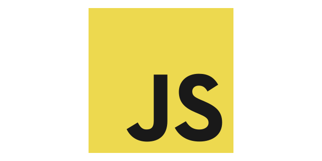
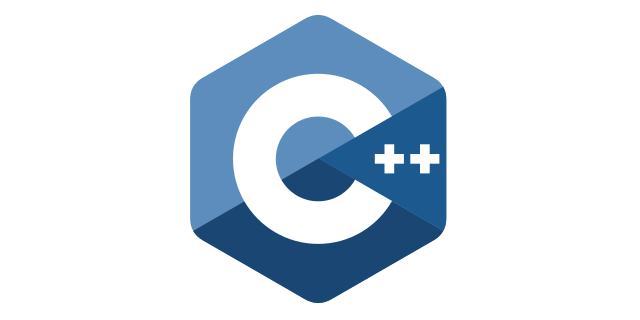

> Things people tell me that they know: "full-stack JavaScript is the Future", "everyone should know C", "Rust is the best language for Systems Programming"... Most people hear stuff like this, and say to themselves, is that true? ~ [Haseeb Qureshi, Converge: Why Engineers Disagree About Everything (Talk)](https://softwareengineeringdaily.com/2017/02/24/convergence-with-haseeb-qureshi/)

Migrating between C++, JavaScript and Rust today has never been easier, language features/syntax seem to be converging, recent updates to each language added features exclusive to other languages.

#### Syntax

```js
// JS         // C++         // Rust
let x = 4;    auto x = 4;    let x = 4;
```

#### Features

- **ECMAScript 2017** (JS) now features shared memory and atomics, and even things like threads are possible through *service workers*.

- **C++ 17** now features array destructuring, and upcoming features like modules will make the language even closer to higher order languages.

- **Rust** now has a TypeScript-like [Language Server](https://github.com/rust-lang-nursery/rls), which is similar to Visual Studio's C++ Intelisense.

Performance across each language is also getting closer:

1. JavaScript's WebAssembly proposal is bringing with it a huge boost in performance, and regular JavaScript is among the fastest dynamically typed languages out there. (Ruby, Python, etc.)

2. C++ through it's long history of focusing on performance, has always been extremely fast. 

3. Rust is fast, at times even better than C/C++ in performance, according to [The Computer Language Benchmarks Game K-Nucleotide benchmark](http://benchmarksgame.alioth.debian.org/u64q/knucleotide.html).

### Table of Contents

1. **Installation** - Get off the ground and programming immediately.

2. **Modules** - Creating and installing modules, and how to structure your modules/applications.

3. **Syntax** - An overview of the syntax differences of each language.

## JavaScript



*Brendon Eich* is known as a bit of an apologist because of some bad decisions early on with the language, nevertheless, thanks to no small effort on the part of the many people contributing to the evolution of the language, modern JavaScript is a pleasure to develop in.

### Installation

Visit [The Node Foundation](https://nodejs.org) and download the *current* version of Node.

Alternatively you can visit a code editing website like [Codepen](https://codepen.io/pen), but bear in mind there are missing features between browser and server versions of JS.

There's also TypeScript and Flow, tools that add static type checking to the JavaScript language.

> **Recommended** - Use a Type checker like [TypeScript](http://www.typescriptlang.org/) or [Flow](https://flow.org/) for your code.

### File Structure

```
├─ src/
│  ├─ api/
│  │  └─ index.js
│  └─ main.js
└─ package.json
```

### Execution

```bash
# Installing Packages
npm i <package-name>

# Running Programs
node <javascript-file-name>
```

## C++



C++ is a mature language that has a lot of heritage. Developed by *Bjarne Stroustrup* in Bell Labs as an extension to C, it became its own language once people coming from C began to see how much more maintainable their codebases were with class hierarchies and template metaprogramming.

### Installation

No matter what platform you're developing on, you'll want to have the following tools:

- [CMake](https://cmake.org) - The most popular package toolchain for C++, abstracts your project away from your IDE and makes compiling libraries easier.
- [Conan](https://conan.io) - The most popular C++ package manager, makes dependency management in C++ much easier.

#### Windows

Download [Visual Studio 2017 Community Edition](https://www.visualstudio.com).

#### Linux

```bash
apt-get install gcc
# or
apt-get install clang
```

#### OSX

Download [XCode](https://developer.apple.com/download/).

## Rust


Rust has become pretty popular, with exciting research projects ranging from using it to build web browsers like [Servo](https://servo.org/) to even entire [operating systems](http://www.redox-os.org/) and [game engines](http://www.piston.rs/).

This is thanks to the strong emphasis on [ergonomics, performance, and security](https://blog.rust-lang.org/2017/03/02/lang-ergonomics.html) that the Rust standard body pushes for.

[Jack Moffitt](https://twitter.com/metajack), developer for the Rust powered browser Servo, said on [The Changelog](https://changelog.com/podcast/228) that:

> "All of [ our security critical bugs with Firefox WebAudio ] were array out of bounds/use after free errors and all of them would have been prevented by the Rust compiler [ instead of C ]."

### Installation

#### Windows

Visit [win.rustup.rs](https://win.rustup.rs/) to get an installer `.exe`.

#### Linux / OSX

```bash
curl https://sh.rustup.rs -sSf | sh
# You should see:
# Rust is installed now. Great!
```

From there you can easily find integrations with code editors like [VS Code](https://github.com/KalitaAlexey/vscode-rust) or [Atom](https://atom.io/packages/language-rust).

### File Structure

In Rust, any folder can be a module if it has a `Cargo.toml` file (which is basically an `.ini` file similar to NPM's `package.json`), and often you'll see a script to handle building the package as well.

```bash
├─ src/
│  ├─ api/
│  │  └─ mod.rs # Same as index.js in commonjs
│  └─ main.rs
├─ Cargo.toml
└─ build.rs     # (Optional) Same as build script in node
```

Here's a sample `Cargo.toml` file:

```yml
[package]
name = "multitouch-fabric-visualizer"
version = "0.1.0"
authors = ["Alain Galvan <hi@alain.xyz>"]
build = "build.rs"

[dependencies]
serial = "0.3.4"
cpal = "0.4.4"
winit = "0.5.2"
vulkano = "0.3.2"
vulkano-win = "0.3.2"

[build-dependencies]
vk-sys = "^0.2.2"
vulkano-shaders = "0.3.2"
```

### Execution

```bash
#Installing packages requires you to edit your Cargo.toml file.

# Check for errors
# Recomended: Use Rust Language Server
# https://github.com/editor-rs/vscode-rust/blob/master/doc/rls_mode/main.md
cargo check

# Run program
cargo run

# Compile Executable
cargo build # Use the --release flag for a production build
```

## Syntax

### Imports, Namespaces, Exports

With node, every JavaScript file is treated as an isolated module, and the `index.js` file of a given folder indicates the folder's root JavaScript file.

```js
// 💛 TypeScript

// Import (Package `fs` is included with node)
import fs from 'fs';

// Namespace
const { readFileSync } = fs;

// Export 
export function myexport(code: string): number {
    return 0;
}

// Export all from module
export * from './localmodule';
```

Until C++ Modules come along, the following is the standard way of modularizing code. There's no strict path rules in C++.

```cpp
// 💙 C++

// Import
#include "ifstream"
//Need the following imports for types
#include "stdio.h"
#include "string"

// Namespace
using namespace std;

// any declaration is exported by default
uint32_t myexport(string code)
{
    return 0;
}
```

Modules in **Rust** follow the convention of having `mod.rs` indicate the root module of a given folder, and every submodule must be declared with the keyword `mod`.

```rust
// 💖 Rust
// Import
// External package from cargo
extern crate winit;

// Local module (must be declared)
mod localmodule;

// Namespace
use std::*;

// Export
pub fn myexport(code: &str) -> u32 {
    return 0;
}

// Export from local module
pub use self::localmodule::*;
```

### Enums

Enums don't exist in JavaScript, but are available in TypeScript:

```ts
// 💛 TypeScript
enum Enums {
    One,
    Two
}
```

```cpp
// 💙 C++
enum Enums {
    One,
    Two
}
```

```rust
// 💖 Rust
enum Enums {
    One,
    Two
}
```

### Structs

JavaScript doesn't have types, so no need to define structs. Types aren't limited to being just structs in TypeScript though.

```ts
// 💛 TypeScript / Flow
type Structs = {
  property: number
}
```

```cpp
// 💙 C++
struct Structs
{
    uint32_t property;
}
```

```rust
// 💖 Rust
struct Structs {
    property: u32
}
```

### Classes

```js
// 💛 JavaScript
class MyClass {

    constructor(member = 0) {
        this.member = member;
    }

    mutateMember() {
        this.member += 1;
    }
}

let o = new MyClass();
```

Normally in C++ you would declare your class in a header `.h` or `.hpp` file, and write the implementation in a `.cpp` file. Alternatively you can use just a header and write the implementation as inline statements, or write the implementation in the class, but you'll need to juggle when you declare variables/functions.

```cpp
// 💙 C++
class MyClass
{

    uint32_t member = 0;

    MyClass(uint32 pMember) : member(pMember)
    {

    }

    void mutateMember() {
        member += 1;
    }

};

```

In Rust, there is no keyword `class`, instead you can create class-like constructs through a struct to represent your state, and implementation blocks (`impl`), which are sort of like `cpp` files. 

```rust
// 💖 Rust
pub struct MyClass {
    member: u32;
}

impl MyClass {

    pub fn new() -> MyClass {
        MyClass {
            member: 0
        }
    }

    pub fn mutate_member(&mut self) {
        self.member += 1;
    }
}
```

### Functions

JavaScript features 2 function types, the first being a `function` bound to the global scope unless specified otherwise, and the second being bound to the scope of where the function was declared, **Fat Arrow Functions**.

```js
// 💛 JS
function myFunction() {
    return 0;
}

let lambda = () => null;
```

In C++ lambdas are denoted with a scope capture `[...scopevars]`, followed by the standard parenthesis for arguments and curly brace for the body of the function `() { }`.

```cpp
// 💙 C++
uint32_t myFunction() {
    return 0;
}

auto lambda = []()
{
    return null;
};

```

In Rust lambdas follows the signature `|...params| { body }`, with the curly braces around the body being optional.

```rust
// 💖 Rust
fn my_function() -> u32 {
    0
}

fn ten_times<F>(f: F) where F: Fn(i32) {
    for index in 0..10 {
        f(index);
    }
}

ten_times(|j| println!("hello, {}", j));
```

### Destructuring

```js
// 💛 JS

// Array Destructuring
let arr = [1, 2, 3, 4, 5];

// Grab 1, and [2, 3, 4, 5]
let [first, ...rest] = arr;

// Object Destructuring
let obj = {
    x: 1,
    y: 2,
    z: 3
};

// Grab variables from obj
let {x, y, z} = obj;
```

C++ 17 recently added destructuring as a native language feature:

```cpp
// 💙 C++

std::vector<uint32_t> arr = { 1, 2, 3, 4, 5 };

// Rest operator isn't available
auto [first, second, third] = arr;

// Object Destructuring isn't avaiable either
```

Rust has intuitive destructuring for Structs and arrays:

```rust
// 💖 Rust

// Array Destructuring
let arr = [0, 1, 2, 3, 4, 5];

let [first, ...rest] = arr;

// Object Destructuring
struct Obj {
    x: u32,
    y: u32,
    z: u32
}

let obj = Obj { x: 0, y: 0, y: 0 };

let Obj { x, y, z } = obj;
```

### Interfaces

```ts
// 💛 TypeScript / Flow
type Renderable = {
  render: () => void
}
```

C++ interfaces are possible through classical inheritance.

```cpp
// 💙 C++
class Renderable {
public:
   virtual void render();
}
```

```rust
// 💖 Rust
trait Renderable {
    pub fn render(&self);
}
```

### Templates/Generics

There's no such thing as templates/generics in JS, but you do have Generics in TypeScript and Flow.

```js
// 💛 JS
function lol<T>(what: T) {

}
```

```cpp
// 💙 C++
template<typename T>
void lol(T what)
{

}
```

```rust
// 💖 Rust
fn lol<T>(what: T) {

}
```


### Common Modules

```js
// 💛 JS
import fs from 'fs';
import path from 'path';
```

```cpp
// 💙 C++
#include "ifstream"
#include "path"
```

```rust
// 💖 Rust
use std::io;
use std::path;
```

## Conclusion & Further Reading

Getting a full grasp of a programming language to the point where you're able to write anything takes time, however reading each language's manual will help tremendously.

### JavaScript

The [TypeScript Handbook](http://www.typescriptlang.org/docs/handbook/basic-types.html) gives a clear introduction to the newest JavaScript features as well as teaching best practices with the TypeScript toolset.

For more resources, check out my post on [developing javascript applications](https://alain.xyz/blog/designing-a-web-app).

### C++

[The C++ Programming Language](https://www.amazon.com/C-Programming-Language-4th/dp/0321563840) book by the author of the language, Bjorne Strustrup, is a great summary of the entire language.

For more resources, check out my post on [designing C++ libraries.](https://alain.xyz/blog/designing-a-cpp-library).

### Rust

Rust features advanced variable binding patterns that come from functional programming, so be sure to review the [chapter on patterns](https://doc.rust-lang.org/book/patterns.html#bindings).

### Talks

- [Rust 101 - E. Dunham, Linux Conf Australia 2017](https://www.youtube.com/watch?v=FMqydRampuo)

### Podcasts

- [New Rustacean](http://www.newrustacean.com/)

### Books

- [The Rust Programming Language](https://doc.rust-lang.org/book/)
- [Rust Guidelines](https://aturon.github.io/README.html)
- [Rust by Example](http://rustbyexample.com/)

### Communities

- [Rust Discord Group](https://discord.me/rust-lang)
- [r/rust Subreddit](https://www.reddit.com/r/rust/)