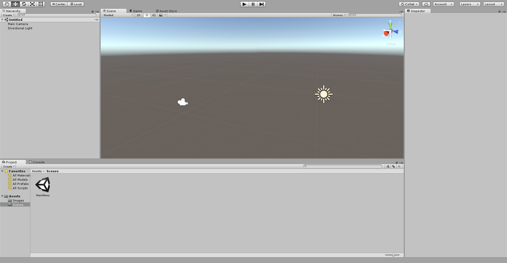
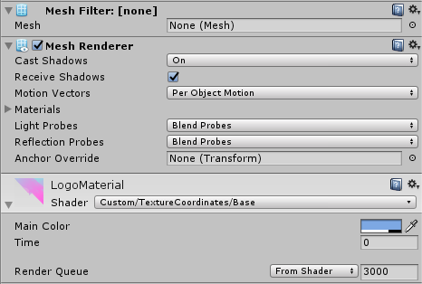

Unity is the most popular game engine in the world, used by Nintendo, Square Enix, and many independent developers to quickly build cross platform games.

## File Hierarchy

Most projects in Unity organizes files by *Type*.

```bash
├─ Assets/
│   ├─ Scenes
│   ├─ Materials
│   ├─ Models
│   ├─ Prefabs
│   ├─ Scripts
│   └─ ...
├─ ProjectSettings/
│   └─ ...
└─ readme.md
```

With groups of Materials, Models, and Scripts often organized themselves loosely into Components.

```bash
├─ Assets/
│   ├─ DialogueSystem
│   ├─ ProceduralTrees
│   └─ ...
├─ ProjectSettings/
│   └─ ...
└─ readme.md
```

When files are indexed by the engine, they are given a unique global id (GUID), a hash that points to that file in a coresponding hashmap internal to Unity.

```yml
fileFormatVersion: 2
guid: 61e3a4077f0adfe4ab171bb5876d2cf9
timeCreated: 1485466431
licenseType: Free
DefaultImporter:
  userData: 
  assetBundleName: 
  assetBundleVariant: 
``` 

### Engine State

Unity actually stores all of the state of your application within your scenes, which sets whatever settings you gave your gameobjects and their components.

You can see that parameters like `ugid`s, components and their corresponding settings, are all here.

```yaml
%YAML 1.1
%TAG !u! tag:unity3d.com,2011:
--- !u!1 &1255243119
GameObject:
  m_ObjectHideFlags: 0
  m_PrefabParentObject: {fileID: 0}
  m_PrefabInternal: {fileID: 0}
  serializedVersion: 5
  m_Component:
  - component: {fileID: 1255243122}
  - component: {fileID: 1255243121}
  - component: {fileID: 1255243120}
  m_Layer: 0
  m_Name: GameObject
  m_TagString: Untagged
  m_Icon: {fileID: 0}
  m_NavMeshLayer: 0
  m_StaticEditorFlags: 0
  m_IsActive: 1
--- !u!114 &1255243120
MonoBehaviour:
  m_ObjectHideFlags: 0
  m_PrefabParentObject: {fileID: 0}
  m_PrefabInternal: {fileID: 0}
  m_GameObject: {fileID: 1255243119}
  m_Enabled: 1
  m_EditorHideFlags: 0
  m_Script: {fileID: 11500000, guid: 7e1c1e7574b2f4141848e773e69996b4, type: 3}
  m_Name: 
  m_EditorClassIdentifier: 
--- !u!4 &1255243122
Transform:
  m_ObjectHideFlags: 0
  m_PrefabParentObject: {fileID: 0}
  m_PrefabInternal: {fileID: 0}
  m_GameObject: {fileID: 1255243119}
  m_LocalRotation: {x: 0, y: 0, z: 0, w: 1}
  m_LocalPosition: {x: 0, y: 0, z: 0}
  m_LocalScale: {x: 1, y: 1, z: 1}
  m_Children: []
  m_Father: {fileID: 0}
  m_RootOrder: 0
  m_LocalEulerAnglesHint: {x: 0, y: 0, z: 0}
```

## Editor Design



Each pane in Unity is given it's own OS Window and Rendering Context, and are simply positioned/sized by the engine's window management system.

Rendering updates to the window depend on user interactions (Reactive model), otherwise it simply doesn't refresh rendering.


Rendering the UI is a few draw calls, with text batched into a single call.


## C# Runtime

Unity's low level engine code is interfaced using C#, an ECMA standard like JavaScript that was popularized with the .Net framework by Microsoft. 

Unity allows you to control the engine through *controller scripts* that extend `MonoBehavior`:

```cs
using UnityEngine;

// Classes/Variables can be decorated
[RequireComponent(typeof(Renderer))]
public class MyController : MonoBehaviour
{

    void Start()
    {
      // Start is called when the scene and all object have been initialized.
      // Grab references to other Components
      // Or refernces to other GameObjects
    }

    void Update()
    {
        // Update is called every frame
    }

    /// <summary>
    /// You can write documentation in XML.
    /// </summary>
    /// <param name="res">You can even refer to parameters.</param>
    /// <returns>And Return Types!</returns>
    void _PrivateFunction(int i)
    {
      // ...
    }
}

```

These scripts are then *serialized* by Unity, which uses the information in your script to build a UI view for your component. This view lets you easily send information from the scene to your controller logic.

### C# Code Style

- **NameSpaces/Classes/Enums/Structs/Functions** - CamelCase with the first character Capitalized.

- **Variables** - camelCase with first character lower cased.

- **Private** - camelCase with the first character as an underscore, the second lower cased, default behavior.

- **Comments** - C# Lets you write XML for your docs.

By default every class/enum you include in your project is available in the entire C# runtime no matter where you placed the file, so it's your responsibility to alias modules through namespaces instead of `import` statements like JavaScript or Python.

## Renderer



- **Material** - An interface between a shader and other parts of the engine. You can set uniforms, use as a reference for postprocessing systems, etc.

- **Mesh** - A pointer to a set of primitives, which multiple materials can be assigned to.

- **Renderer** - A component that handles the rendering of a mesh with a given material.

\[ N_{Material} \rightarrow 1_{Shader} \]

Shaders written as a single HLSL file that handles all the steps of the Graphics Pipeline. Unity lets you include shader libraries with the extension `.cginc`. 

For cross platform support, your HLSL code is compiled to GLSL by [HLSL2GLSL](https://github.com/aras-p/hlsl2glslfork).

## Resources

### People

- [Keijiro Takahashi](https://github.com/keijiro) - Unity Japan, is constantly working on interesting bite sized projects.
- [Seiya Ishibashi](https://github.com/i-saint) - Unity Japan, working on integrations with various APIs and systems like Pixar.

### Discussion

- [r/unity3d](https://reddit.com/r/unity3d)
