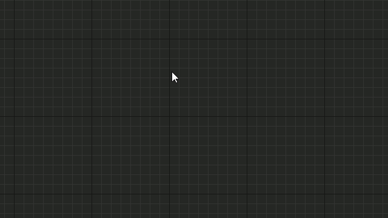
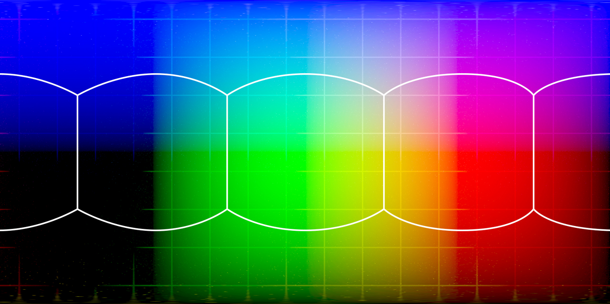

For my [Realtime Celestial Rendering Paper](https://github.com/OpenHID/realtime-celestial-rendering), I made a dynamic, responsive stary sky that the player would see while exploring the star system. To do this, I wrote a some shaders that renders onto a cubemap texture target, which could then be used as a simple skybox or as an animated radiance / irradiance cubemap for Physically Based Rendering.


To make this more manageable and portable, the shader was written in **HLSL** rather than using Unreal's Material compositor tools.



Not that it isn't possible with the custom node in Unreal's Material Editor, but C++ gives you more programmatic freedom.

>Step By Step Process:
>1. Create Shader Plugin
>  - Use Unreal Plugin Wizard
>  - Create a subclass of the FGlobalShader Class
>  - Write your .usf (Unreal Shader Format) file.
>  - Bind Uniforms
>2. Execute Shader in Game Engine
>  - create a `new YourShaderPlugin(params)` object.
>  - Update the render target whenever you would like.

### Cubemap Textures



A **Cubemap Texture** is a 6 sided texture that allows for very low cost sampling of an environmental texture that can serve as a skybox or mapped onto any object with normals, or mapped onto a cube. This means this texture could potentially be used as a light source for PBR calculations, so it's a good idea to make it an HDR texture for skyboxes.

There's several ways to map a cubemap texture, linearly, boxlike, panoramic (what unreal uses), having 6 separate textures. The standard is currently native cubemaps since they're fast, can easily be used as light sources or reflection sources.

## Unreal Structure

The **Render Hardware Interface (RHI)** is Unreal's rendering abstraction layer that communicates with OpenGL or DirectX, and this, combined with a cross compiler for HLSL code, let's you write platform independent shaders. It's from here and related systems like the RenderCore, Renderer, and ShaderCore where we'll be getting our data structures/macros. Here's a few of the headers involved with the **RHI**.

```bash
|- UnrealEngine/Engine/Source/Runtime/RHI/Public
	|- RHICommandList.h 	# Manages Rendering Queue
	|- RHIResources.h		# Stores Abstract Graphics Data Structures
|- UnrealEngine/Engine/Source/Runtime/RenderCore/Public
    |- RenderingThread.h 	# Rendering requests are Enqueued Here
```

The **RHI** manages a rendering queue, handles all render requests. You need to make requests to the RHI to render onto your rendertarget.

```cpp
void FCubeRenderTargetShader::RunShader(UTextureRenderTargetCube* RenderTarget, float time) {

	//Setup ECubeFace Struct (Just a basis matrix of the current face)

	for (int32 faceidx = 0; faceidx < (int32)ECubeFace::CubeFace_MAX; faceidx++)
	{
		const ECubeFace TargetFace = (ECubeFace)faceidx;
		const FMatrix ViewRotationMatrix = FLocal::CalcCubeFaceTransform(TargetFace);

		ENQUEUE_UNIQUE_RENDER_COMMAND_THREEPARAMETER(
			FPixelShaderRunner,
			FCubeRenderTargetShader*, PixelShader, this,
			ECubeFace, TargetFace, TargetFace,
			FMatrix, ViewRotationMatrix, ViewRotationMatrix,
			{
				PixelShader->RunShaderInternal(FResolveParams(FResolveRect(), TargetFace), ViewRotationMatrix);
			});
	}
}

void FCubeRenderTargetShader::RunShaderInternal(const FResolveParams& ResolveParams, const FMatrix mat, UTextureRenderTargetCube* CurRenderTarget)
{
		//Set Uniforms
		VariableParameters.ViewMatrix = mat;

		check(IsInRenderingThread());
		FRHICommandListImmediate& RHICmdList = GRHICommandList.GetImmediateCommandList();

		//Create temp rendertarget for the face.
		auto& RenderTarget = CurRenderTarget->GetRenderTargetResource()->GetRenderTargetTexture();
		FPooledRenderTargetDesc Desc(FPooledRenderTargetDesc::Create2DDesc(
			FIntPoint(CurRenderTarget->GetSurfaceWidth(), CurRenderTarget->GetSurfaceHeight()),
			RenderTarget.GetReference()->GetFormat(),
			FClearValueBinding::None,
			TexCreate_None,
			TexCreate_RenderTargetable,
			false));

		SetRenderTarget(RHICmdList, RenderTarget, NULL);
		RHICmdList.SetBlendState(TStaticBlendState<>::GetRHI());
		RHICmdList.SetRasterizerState(TStaticRasterizerState<>::GetRHI());
		RHICmdList.SetDepthStencilState(TStaticDepthStencilState<false, CF_Always>::GetRHI());

		static FGlobalBoundShaderState BoundShaderState;
		TShaderMapRef<FVertexShaderExample> VertexShader(GetGlobalShaderMap(FeatureLevel));
		TShaderMapRef<FPixelShaderDeclaration> PixelShader(GetGlobalShaderMap(FeatureLevel));

		SetGlobalBoundShaderState(RHICmdList, FeatureLevel, BoundShaderState, GTextureVertexDeclaration.VertexDeclarationRHI, *VertexShader, *PixelShader);
		PixelShader->SetUniformBuffers(RHICmdList, ConstantParameters, VariableParameters);

		//draw Surface Quad

		//Copy onto the RenderTargetCube
		RHICmdList.CopyToResolveTarget(CurRenderTarget->GetRenderTargetResource()->GetRenderTargetTexture(), CurRenderTarget->GetRenderTargetResource()->TextureRHI, false, ResolveParams);

		bIsPixelShaderExecuting = false;
	}
```

### Making Plugins

To make managing custom shaders easier, it's a good idea to create a plugin for your Unreal Engine build that features the shader you're making. In this plugin you can put all the logic related to your shader. In our project, I made a plugin called **CubeRenderTargetShader**, a plugin that gives you the ability to write a shader built into the plugin onto a cubemap.

Here's the file structure of the plugin:

```bash
|- Public
	|- CubeRenderTargetShader.h 	#Class that is called from in game actors.
	|- PixelShaderDeclaration.h
	|- PixelShaderPrivatePCH.h
|- Private
	|- CubeRenderTargetShader.cpp
	|- PixelShaderDeclaration.cpp
```

## Writing your Shader

A shader has two interfaces that it can communicate with:

1. a constants uniform buffer for rarely changing variables.
2. a variable uniform buffer for things that change often (per frame variables like time).

the `TEXT("string")` denotes the name of the uniform. This will be an automatically generated struct you can refer to. Note this needs to be unique to the shader since they can be accessed from any shader.

```cpp
//In your .h
BEGIN_UNIFORM_BUFFER_STRUCT(FPixelShaderConstantParameters, )
DECLARE_UNIFORM_BUFFER_STRUCT_MEMBER(float, SimulationSpeed)
END_UNIFORM_BUFFER_STRUCT(FPixelShaderConstantParameters)

BEGIN_UNIFORM_BUFFER_STRUCT(FPixelShaderVariableParameters, )
DECLARE_UNIFORM_BUFFER_STRUCT_MEMBER(FMatrix, ViewMatrix)
DECLARE_UNIFORM_BUFFER_STRUCT_MEMBER(float, TotalTimeElapsedSeconds)
END_UNIFORM_BUFFER_STRUCT(FPixelShaderVariableParameters)ers);

//In your .cpp
IMPLEMENT_UNIFORM_BUFFER_STRUCT(FPixelShaderConstantParameters, TEXT("PSConstants"));
IMPLEMENT_UNIFORM_BUFFER_STRUCT(FPixelShaderVariableParameters, TEXT("PSVariables"));

//...

//Now let's implement the shader!
IMPLEMENT_SHADER_TYPE(, FVertexShaderExample, TEXT("PixelShaderExample"), TEXT("MainVertexShader"), SF_Vertex);
IMPLEMENT_SHADER_TYPE(, FPixelShaderDeclaration, TEXT("PixelShaderExample"), TEXT("MainPixelShader"), SF_Pixel);
```

Now you have everything you need to write your shader! Your shader should be written in as a `.usf` file, and located in `${ProjectDir}/Shaders`. Now making complex shaders isn't too hard, for more details on the subject visit [ShaderToy](http://shadertoy.com). There's a lot of complex shaders done in GLSL, which shouldn't be too hard to port if you look into the [MSDN HLSL Reference](https://msdn.microsoft.com/en-us/library/windows/desktop/bb509638%28v=vs.85%29.aspx). Here's an example of a very simple shader that draws a texture.

## Add your Shader to your Game


To run the shader in game, it was a simple matter of making an actor that executes the command to run the shader and provides the shader with a output target.

```cpp
void ASpaceSky::Tick(float DeltaSeconds)
{
	Super::Tick(DeltaSeconds);

	//Run
	if (NULL != PixelShading)
	{
		PixelShading->RunShader(RenderTargetCube, InputTexture);
	}
}
```