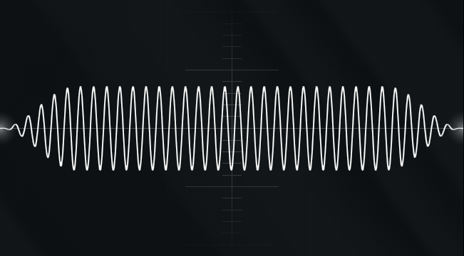

[Shadertoy](https://www.shadertoy.com/) proved that being a good rendering engineer is just like being a good sound engineer, and that the mathematics and code for both are for the most part the same.

## Sound Physics & Math



**Sound** is a series of compressions and decompressions in the air.

Instantaneous acoustic pressure (current sound) is the ambient atmospheric pressure plus perturbation (basically noise) caused by sound wave at a determined instant in time.


\[ P_{inst} = P_{atmos} + P_{sound} \]

This is similar to lighting models in computer graphics.

\[ I_{total} = I_{diffuse} + I_{specular} + I_{ambient} \]


### Fourier Transform

[](http://mathworld.wolfram.com/FourierSeries.html)

Fourier Transforms are a method of converting continuous signals to descrete ones, or visa-versa. This is particularly useful in audio jacks, where sound is simply the modulation of voltage, but has other applications, such as [Jpeg Compression](http://stephaniehurlburt.com/blog/2016/12/20/a-taste-of-fourier-transforms-and-jpeg-compression).

## Sampling

Sound on computers is represented by tiny changes on the speaker every *1 / 44100* seconds. (That sounds like a lot more than 60 fps). By themselves, these changes will just sound like pops or won't sound like anything at all, but when fast enough and with enough time, they can sound like anything!

Let's take a look at the source code from [ShaderToy](https://www.shadertoy.com/) that the devs were kind enough to leave unminified for us to check out. 

Behind the scenes what happens is, shadertoy converts whatever sound you write into a 512x512 image with 1/fps seconds of encoded information of that sound, sends it to an AudioContext object, and that plays it.

```js
//Initialize Context
var canvas = document.getElementById("canvas");
var gl = canvas.getContext("webgl") || canvas.getContext("experimental-webgl");

var AudioContext = window.AudioContext || window.webkitAudioContext;
var wa = new AudioContext();

//Audio Ini
var mSampleRate = 44100;
var mPlayTime = 60; //fps
var mPlaySamples = mPlayTime * mSampleRate;
var mBuffer = wa.createBuffer(2, mPlaySamples, mSampleRate);


var bufL = mBuffer.getChannelData(0);
var bufR = mBuffer.getChannelData(1);

var mTextureDimensions = 512;
var mTmpBufferSamples = mTextureDimensions * mTextureDimensions;
var mData = new Uint8Array(mTmpBufferSamples * 4);

var numBlocks = mPlaySamples / mTmpBufferSamples;
for (var j = 0; j < numBlocks; j++) {
  var off = j * mTmpBufferSamples;

  gl.uniform1f(l2, off / mSampleRate);
  gl.drawArrays(gl.TRIANGLES, 0, 6);

//Read encoded information
  gl.readPixels(0, 0, mTextureDimensions, mTextureDimensions, gl.RGBA, gl.UNSIGNED_BYTE, mData);

  for (var i = 0; i < mTmpBufferSamples; i++) {
    bufL[off + i] = -1.0 + 2.0 * (mData[4 * i + 0] + 256.0 * mData[4 * i + 1]) / 65535.0;
    bufR[off + i] = -1.0 + 2.0 * (mData[4 * i + 2] + 256.0 * mData[4 * i + 3]) / 65535.0;
  }
}
```

And in our shader we simply encode a function `mainSound(float time)` onto the output image.

```c
//Get current sample location
float t = iiBlockOffset + (gl_FragCoord.x + gl_FragCoord.y * 512.0) / 44100.0;

//Get Song Function
vec2 y = mainSound(t);

//Encode Output
vec2 v = floor((0.5 + 0.5 * y) * 65536.0); //convert to 16 bit int.
vec2 vl = mod(v, 256.0) / 255.0; //Get decimal portion
vec2 vh = floor(v / 256.0) / 255.0; //Get int portion

gl_FragColor = vec4(vl.x, vh.x, vl.y, vh.y);
```

### Definitions

**Sample** - One measurement of audio data. For Pulse Code Modulation (PCM) encoding, a sample is an instantaneous representation of the voltage of the analog audio. There are other types of encoding, like u-law and a-law, that are rarely used.

**Sampling Rate** - The number of samples in one second. Measured in Hertz (Hz) or kiloHertz (kHz). The most common sampling rate is 44.1 kHz (CD quality).

**Sample Size** - Number of bits in one sample. It is typically a multiple of eight because data is stored in 8-bit bytes. Most common sample size is *16 bits*, which is CD quality audio.

As a comparison, *8 bits* is the number of bits in a single channel of color for images, so imagine a stereo sound as an *image with only red and blue*.

**Channel** - Stereo is the most common form of multi-channel audio (one independent left and one independent right -channel). Higher-end audio formats include 5.1 and 7.2 surround (6 and 9 channels respectively).

**Frame** -  a cross section of samples across all channels in the audio file.
So, a 16-bit stereo (two-channel) audio file will have 32-bit frames (16 bits per sample * 2 channels per frame = 32 bits per frame)

## Practical Example - Polyphony

<iframe width="640" height="360" frameborder="0" src="https://www.shadertoy.com/embed/llfSDj?gui=true&t=10&paused=true&muted=false" allowfullscreen></iframe>

The key takeaway here is the fact that you're rendering sin waves to play frequencies like 440 Hz, or A5 on the keyboard. 

For multiple sounds to play, you simply take the average of the two!

```c
/*************************************************************************
* Synth Primitives
* Everything you should need to get sound on your shaders!
* By Alain Galvan (Alain.xyz) | Lukas Borges (Lukas.xyz)
**************************************************************************
* Constants
*************************************************************************/
#define TAU 6.283185

/*************************************************************************
* Utilities
*************************************************************************/
// note number to frequency
float ntof(float n)
{
    return 440.0 * pow(2.0, (n - 69.0) / 12.0);
}

/*************************************************************************
* Synths
*************************************************************************/
//Sin
float synthSin(float f, float x) {
    return sin(mod(f * x * TAU, TAU));
}

float synthSquare(float f, float x)
{
    return floor( 2.0 * floor( f * x ) - floor( 2.0 * f * x ) + 1.0 );
}

float synthNoise( float x )
{
    return fract( sin( 123523.9898 * x ) * 43758.5453 );
}

/*************************************************************************
* Main
*************************************************************************/
vec2 mainSound(float time)
{
    float tone = synthSquare(ntof(67.0), time);
    float tone2 = synthSquare(ntof(74.0), time);
    float tone3 = synthSquare(ntof(79.0), time);
    return vec2(mix(tone3, mix(tone,tone2, 0.5),0.5));
}
```


