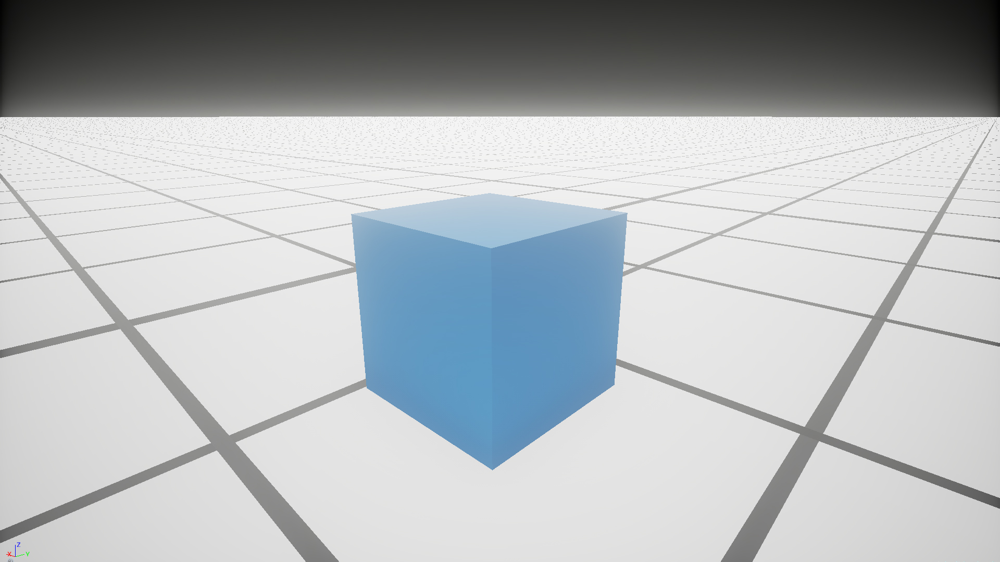
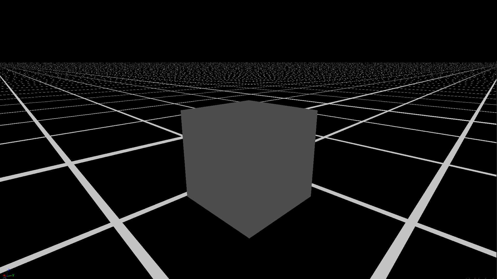
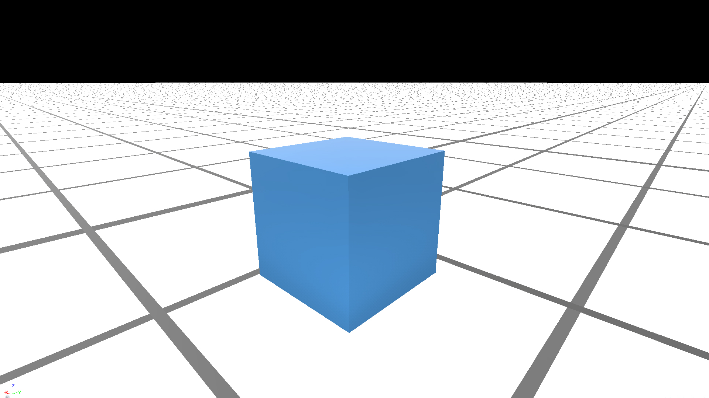

Vulkan is a new low level API released febuary 2016 by the Khronos Group that maps directly to the design of modern GPUs. OpenGL was designed in 1992 when GPUs were far more simple, but since then they have become programmable computational units of their own with a focus on thoroughput over latency.

> I've prepared a [demo](http://github.com/alaingalvan/raw-vulkan-app), inside you'll find platform specific instructions on how to build it. For the sake of brevity I've avoided including some things like listening to window events, etc. We're going to walk through writing the simplest Vulkan app possible, a program that creates a triangle, processes it with a shader, and displays it on a window.

## Instances


Similar to the OpenGL context, a Vulkan application begins when you create an instance. This instance must be loaded with some information about the program such as its name, engine, and minimum Vulkan version, as well any extensions and layers you want to load.

**Extension** - Anything that adds extra functionality to Vulkan, such as support for Win32 windows, or enabling drawing onto a target.

**Layer** - Middleware between existing Vulkan functionality, such as checking for errors. Layers can range from runtime debugging checks to hooks to GPU debugging software like [RenderDoc](https://github.com/baldurk/renderdoc) to even hooks to the Steam renderer so your game can behave better when you `Ctrl + Shift` to switch to the Steam overlay.

```cpp
// Setup Default Extensions/Layers
// You should query for extensions first and build this list from your queries.
// The following should work on Windows systems.

std::vector<const char*> extensions =
{
  VK_KHR_SURFACE_EXTENSION_NAME,
  VK_KHR_WIN32_SURFACE_EXTENSION_NAME,
  VK_EXT_DEBUG_REPORT_EXTENSION_NAME
};

std::vector<const char*> layers =
{
  "VK_LAYER_LUNARG_standard_validation",
  "VK_LAYER_RENDERDOC_Capture"
};

auto appInfo = vk::ApplicationInfo(
  "MyApp",
  VK_MAKE_VERSION(0, 1, 0),
  "MyAppEngine",
  VK_MAKE_VERSION(0, 1, 0),
  VK_MAKE_VERSION(1, 0, 30)
  );

auto instanceInfo = vk::InstanceCreateInfo();

instanceInfo.setPApplicationInfo(&appInfo);
instanceInfo.enabledExtensionCount = extensions.size();
instanceInfo.ppEnabledExtensionNames = extensions.data();
instanceInfo.enabledLayerCount = layers.size();
instanceInfo.ppEnabledLayerNames = layers.data();

auto instance = vk::createInstance(instanceInfo);
```

## Physical Devices


In Vulkan, you have access to all enumerable devices that support it, and can query for information like their name, the number of heaps they support, their manufacturer, etc.

```cpp
// Initialize Devices
auto physicalDevices = instance.enumeratePhysicalDevices();
auto gpu = physicalDevices[0];
```

> **Note** - Multi-GPU processing isn't supported yet on Vulkan (unless 1.1.x is already out when you read this) so this would be useful for choosing the fastest device to use.

## Logical Devices


You can then create a logical device from a physical device handle. A logical device can be loaded with its own extensions/layers, can be set to work with graphics, gpgpu computations, handle sparce memory and/or memory transfers.

A logical device is your interface to the GPU, and allows you to allocate data and queue up tasks.

```cpp
// Init Device Extension/Validation layers
std::vector<const char*> deviceExtensions =
{
  VK_KHR_SWAPCHAIN_EXTENSION_NAME,
  VK_EXT_DEBUG_MARKER_EXTENSION_NAME
};

std::vector<const char*> deviceValidationLayers =
{
  "VK_LAYER_LUNARG_standard_validation",
  "VK_LAYER_RENDERDOC_Capture"
};

auto formatProperties = gpu.getFormatProperties(vk::Format::eR8G8B8A8Unorm);
auto gpuFeatures = gpu.getFeatures();
auto gpuQueueProps = gpu.getQueueFamilyProperties();

auto queueCreateInfos = std::vector<vk::DeviceQueueCreateInfo>();

float priority = 0.0;
uint32_t graphicsFamilyIndex = 0;

for (auto& queuefamily : gpuQueueProps)
{
  if (queuefamily.queueFlags & vk::QueueFlagBits::eGraphics) {
    // Create a single graphics queue.
    queueCreateInfos.push_back(
      vk::DeviceQueueCreateInfo(
        vk::DeviceQueueCreateFlags(),
        graphicsFamilyIndex, 1,
        &priority
      )
    );
    break;
  }

  graphicsFamilyIndex++;

}

auto deviceInfo = vk::DeviceCreateInfo();
deviceInfo.enabledExtensionCount = deviceExtensions.size();
deviceInfo.ppEnabledExtensionNames = deviceExtensions.data();
deviceInfo.enabledLayerCount = deviceValidationLayers.size();
deviceInfo.ppEnabledLayerNames = deviceValidationLayers.data();
deviceInfo.pEnabledFeatures = &gpuFeatures;
deviceInfo.queueCreateInfoCount = queueCreateInfos.size();
deviceInfo.pQueueCreateInfos = queueCreateInfos.data();

auto device = gpu.createDevice(deviceInfo);
```

## Window Surface Interface

Each OS has their own specific window generation system. Vulkan 1.0 currently supports Windows, Android, and Linux windows out of the box, with plans for iOS and Mac OS in the future.

A surface is an adapter abstraction to describe an area that will render Vulkan to a window, it's the binding between Vulkan and your OS's windowing system.

| Extension Name | Required Compile Time Symbol | Window System Name | External Header Files Used |
| :-- | :-- | :-- | :-- |
| `VK_KHR_android_surface` | `VK_USE_PLATFORM_ANDROID_KHR` | Android Native | `<android/native_window.h>` |
|`VK_KHR_mir_surface` | `VK_USE_PLATFORM_MIR_KHR`| Mir | `<mir_toolkit/client_types.h>` |
| `VK_KHR_wayland_surface` | `VK_USE_PLATFORM_WAYLAND_KHR` | Wayland | `<wayland-client.h>`|
| `VK_KHR_win32_surface` | `VK_USE_PLATFORM_WIN32_KHR` | Microsoft Windows | `<windows.h>`|
| `VK_KHR_xcb_surface` | `VK_USE_PLATFORM_XCB_KHR` | X Window System Xcb library | `<xcb/xcb.h>` |
| `VK_KHR_xlib_surface` | `VK_USE_PLATFORM_XLIB_KHR` | X Window System Xlib library | `<X11/Xlib.h>` |

If you want to support multiple platforms, then you'll need to use OS specific preprocessor definitions, and check if they're defined. Alternatively, you could use something like GLFW if you're only interested in supporting Windows and Linux.

```cpp
#if defined(_WIN32)

  // Perform Windows specific logic

#elif defined(__ANDROID__)

  // Perform Android specific logic

#elif defined(__linux__)

  // Perform Linux specific logic

#endif

```

You'll need to keep in mind things like window size, canvas size (supersampling), DPI and retina support, nested windows, window management and spawning multiple windows.

> **Call to Action** - Make a Vulkan library that makes cross platform Vulkan super easy. You can target problems such as how each OS has their own main function, each OS has their own Windowing abstraction, how to manage each and let users access their OS specific handles if needed.

### Win32 Surfaces

A Windows surface is created when you include the `VK_KHR_win32_surface` extension to Vulkan, declare `VK_USE_PLATFORM_WIN32_KHR`, and include `windows.h` in your project.

Creating windows on [Windows is well documented on MSDN](https://msdn.microsoft.com/en-us/library/windows/desktop/ms632680(v=vs.85).aspx), so refer there for any more questions.

```cpp
VULKAN_HPP_TYPESAFE_CONVERSION
#define USE_SWAPCHAIN_EXTENSIONS
#define VK_USE_PLATFORM_WIN32_KHR
#define __INT32_TYPE__

#include "windows.h"
#include "vulkan.hpp"

LRESULT CALLBACK WndProc(HWND hWnd, UINT uMsg, WPARAM wParam, LPARAM lParam)
{
  // Event Listener Logic Here.

  return 0;
}

int APIENTRY WinMain(HINSTANCE hInstance, HINSTANCE hPrevInstance, LPSTR pCmdLine, int nCmdShow)
{
  // Setup Instance

  // Setup Phyisical Devices

  // Setup Logical Devices

  // Setup Window

  std::string title = "MyVulkanApp";
  std::string name = "MyVulkanApp";
  uint32_t width = 1280;
  uint32_t height = 720;

  // Attach Console

  AllocConsole();
  AttachConsole(GetCurrentProcessId());

  FILE *stream;
  freopen_s(&stream, "CONOUT$", "w+", stdout);
  SetConsoleTitle(TEXT(title.c_str()));

  WNDCLASSEX wndClass;

  wndClass.cbSize = sizeof(WNDCLASSEX);
  wndClass.style = CS_HREDRAW | CS_VREDRAW;
  wndClass.lpfnWndProc = WndProc;
  wndClass.cbClsExtra = 0;
  wndClass.cbWndExtra = 0;
  wndClass.hInstance = hInstance;
  wndClass.hIcon = LoadIcon(NULL, IDI_APPLICATION);
  wndClass.hCursor = LoadCursor(NULL, IDC_ARROW);
  wndClass.hbrBackground = (HBRUSH)GetStockObject(BLACK_BRUSH);
  wndClass.lpszMenuName = NULL;
  wndClass.lpszClassName = name.c_str();
  wndClass.hIconSm = LoadIcon(NULL, IDI_WINLOGO);

  if (!RegisterClassEx(&wndClass))
  {
    fflush(stdout);
    exit(1);
  }

  int screenWidth = GetSystemMetrics(SM_CXSCREEN);
  int screenHeight = GetSystemMetrics(SM_CYSCREEN);

  DWORD dwExStyle;
  DWORD dwStyle;

  dwExStyle = WS_EX_APPWINDOW | WS_EX_WINDOWEDGE;
  dwStyle = WS_OVERLAPPEDWINDOW | WS_CLIPSIBLINGS | WS_CLIPCHILDREN;

  RECT windowRect;
  windowRect.left = 0L;
  windowRect.top = 0L;
  windowRect.right = (long)width;
  windowRect.bottom = (long)height;

  AdjustWindowRectEx(&windowRect, dwStyle, FALSE, dwExStyle);

  std::string windowTitle = "WindowTItle";
  auto window = CreateWindowEx(0,
                               name.c_str(),
                               windowTitle.c_str(),
                               dwStyle | WS_CLIPSIBLINGS | WS_CLIPCHILDREN,
                               0,
                               0,
                               windowRect.right - windowRect.left,
                               windowRect.bottom - windowRect.top,
                               NULL,
                               NULL,
                               hInstance,
                               NULL);

  // Center on screen
  uint32_t x = (GetSystemMetrics(SM_CXSCREEN) - windowRect.right) / 2;
  uint32_t y = (GetSystemMetrics(SM_CYSCREEN) - windowRect.bottom) / 2;
  SetWindowPos(window, 0, x, y, 0, 0, SWP_NOZORDER | SWP_NOSIZE);

  if (!window)
  {
    printf("Could not create window!\n");
    fflush(stdout);
    exit(1);
  }

  ShowWindow(window, SW_SHOW);
  SetForegroundWindow(window);
  SetFocus(window);

  // Setup Surface
  auto surfaceSize = vk::Extent2D(width, height);
  auto surfaceInfo = vk::Win32SurfaceCreateInfoKHR(vk::Win32SurfaceCreateFlagsKHR(), hInstance, window);
  auto vkSurfaceInfo = surfaceInfo.operator const VkWin32SurfaceCreateInfoKHR &();

  auto surface = vk::SurfaceKHR();
  auto createwin32surface = vkCreateWin32SurfaceKHR(instance, &vkSurfaceInfo, NULL, &surface.operator VkSurfaceKHR);
  assert(createwin32surface == VK_SUCCESS);

  // Get surface information

  auto surfaceCapabilities = gpu.getSurfaceCapabilitiesKHR(surface);
  auto surfaceFormats = gpu.getSurfaceFormatsKHR(surface);
  auto surfacePresentModes = gpu.getSurfacePresentModesKHR(surface);

  // Check to see if we can display rgb colors.
  vk::Format colorFormat;
  vk::ColorSpaceKHR colorSpace;

  if (surfaceFormats.size() == 1 && surfaceFormats[0].format == vk::Format::eUndefined)
    colorFormat = vk::Format::eB8G8R8A8Unorm;
  else
    colorFormat = surfaceFormats[0].format;

  colorSpace = surfaceFormats[0].colorSpace;

  // ...
}
```

## Swapchain

A **Swapchain** is a structure that manages the allocation of frame buffers to be cycled through by your application. It's here that your application sets up V-Sync via double buffering or triple buffering.

> One approach to setting this up is to take in a JSON file at the start of your application, say `config.json`, which determines if you'll be using V-Sync, your screen resolution, any any other global data you want to configure.

```cpp
auto surfaceCapabilities = gpu.getSurfaceCapabilitiesKHR(surface);
auto surfacePresentModes = gpu.getSurfacePresentModesKHR(surface);

// check the surface width/height.
if (!(surfaceCapabilities.currentExtent.width == -1 || surfaceCapabilities.currentExtent.height == -1)) {
  surfaceSize = surfaceCapabilities.currentExtent;
}

auto presentMode = vk::PresentModeKHR::eImmediate;

for (auto& pm : surfacePresentModes) {
  if (pm == vk::PresentModeKHR::eMailbox) {
    presentMode = vk::PresentModeKHR::eMailbox;
    break;
  }
}

assert(surfaceCapabilities.maxImageCount >= 3);
auto swapchainCreateInfo = vk::SwapchainCreateInfoKHR();
swapchainCreateInfo.surface = surface;
swapchainCreateInfo.minImageCount = 3;
swapchainCreateInfo.imageFormat = colorFormat;
swapchainCreateInfo.imageColorSpace = colorSpace;
swapchainCreateInfo.imageExtent = surfaceSize;
swapchainCreateInfo.imageArrayLayers = 1;
swapchainCreateInfo.imageUsage = vk::ImageUsageFlagBits::eColorAttachment;
swapchainCreateInfo.imageSharingMode = vk::SharingMode::eExclusive;

std::vector<uint32_t> queueFamilyIdices;
queueFamilyIdices.push_back(graphicsFamilyIndex);

swapchainCreateInfo.queueFamilyIndexCount = queueFamilyIdices.size();
swapchainCreateInfo.pQueueFamilyIndices = queueFamilyIdices.data();
swapchainCreateInfo.preTransform = vk::SurfaceTransformFlagBitsKHR::eIdentity;
swapchainCreateInfo.compositeAlpha = vk::CompositeAlphaFlagBitsKHR::eOpaque;
swapchainCreateInfo.presentMode = presentMode;

auto swapchain = device.createSwapchainKHR(swapchainCreateInfo);
auto swapchainImages = device.getSwapchainImagesKHR(swapchain);

// Lets group these images into a custom struct:

struct SwapChainBuffer {
  vk::Image image;
  vk::ImageView view;
  vk::Framebuffer frameBuffer;
};

std::vector<SwapChainBuffer> swapchainBuffers;
swapchainBuffers.resize(swapchainImages.size());

for (int i = 0; i < swapchainImages.size(); i++)
{
  swapchainBuffers[i].image = swapchainImages[i];

  swapchainBuffers[i].view = device.createImageView(
    vk::ImageViewCreateInfo(
      vk::ImageViewCreateFlags(),
      swapchainImages[i],
      vk::ImageViewType::e1D,
      colorFormat,
      vk::ComponentMapping(),
      vk::ImageSubresourceRange()
    )
  );

  swapchainBuffers[i].frameBuffer = device.createFramebuffer(
    vk::FramebufferCreateInfo(
      vk::FramebufferCreateFlags(),
      renderpass,
      1,
      &swapchainBuffers[i].view,
      surfaceSize.width,
      surfaceSize.height,
      1
    )
  );
}
```


## Synchronization

Vulkan was designed with conccurency in mind, so you're free to use Mutexes, and built in Vulkan Semaphores and Fences for GPU level Synchronization.

Semaphores coordinate operations within the graphics queue and ensure correct command ordering.

```cpp
// Semaphore used to ensures that image presentation is complete before starting to submit again
auto presentCompleteSemaphore = device.createSemaphore(vk::SemaphoreCreateInfo());

// Semaphore used to ensures that all commands submitted have been finished before submitting the image to the queue
auto renderCompleteSemaphore = device.createSemaphore(vk::SemaphoreCreateInfo());

// Fence for command buffer completion
std::vector<vk::Fence> waitFences;
waitFences.resize(swapchainBuffers.size());
for (int i = 0; i < waitFences.size(); i++)
{
  waitFences[i] = device.createFence(vk::FenceCreateInfo(vk::FenceCreateFlagBits::eSignaled));
}
```

## Render Pass

|   | Unreal Engine 4 Render Passes |   |
|:-:|:-:|:-:|
|  |  |  |
|  |  |  |
For defered rendering solutions, Vulkan makes render passes first class, letting you describe your whole postprocessing system as a list of **SubPasses**, groupings of rendered data like a color and depth buffer.

- **Attachment Description** - a description of the image view that will be attached to the subpass.

- **Attachment Reference** - an index name to refer to the framebuffer attachment accessed by different subpasses.

- **Subpass** - A phase of rendering within a render pass, that reads and writes a subset of the attachments.

- **Subpass Dependency** - an execution or memory dependency between different subpasses. This would be for example, the `sampler2D` that you would access in a post-processing system that is waterfalled down the chain of effects.

```cpp
// Describe grouped data that the render pass expects to read/write to
// As attachments. (Color, Depth)
std::vector<vk::AttachmentDescription> attachments =
{
  vk::AttachmentDescription(
    vk::AttachmentDescriptionFlags(),
    vk::Format::eB8G8R8A8Unorm,
    vk::SampleCountFlagBits::e1,
    vk::AttachmentLoadOp::eClear,
    vk::AttachmentStoreOp::eStore,
    vk::AttachmentLoadOp::eClear,
    vk::AttachmentStoreOp::eStore,
    vk::ImageLayout::eUndefined,
    vk::ImageLayout::ePresentSrcKHR
  )
};

std::vector<vk::AttachmentReference> colorReferences =
{
  vk::AttachmentReference(0, vk::ImageLayout::eColorAttachmentOptimal)
};

std::vector<vk::SubpassDescription> subpasses =
{
  vk::SubpassDescription(
    vk::SubpassDescriptionFlags(),
    vk::PipelineBindPoint::eGraphics,
    0,
    nullptr,
    colorReferences.size(),
    colorReferences.data(),
    nullptr,
    nullptr,
    0,
    nullptr
  )
};

std::vector<vk::SubpassDependency> dependencies =
{
  vk::SubpassDependency(
    ~0U,
    0,
    vk::PipelineStageFlags(vk::PipelineStageFlagBits::eAllGraphics),
    vk::PipelineStageFlags(vk::PipelineStageFlagBits::eAllGraphics),
    vk::AccessFlags(vk::AccessFlagBits::eMemoryRead),
    vk::AccessFlags(vk::AccessFlagBits::eColorAttachmentRead | vk::AccessFlagBits::eColorAttachmentWrite)
  )
};

auto renderpass = device.createRenderPass(
  vk::RenderPassCreateInfo(
    vk::RenderPassCreateFlags(),
    attachments.size(),
    attachments.data(),
    subpasses.size(),
    subpasses.data(),
    dependencies.size(),
    dependencies.data()
  )
);
```
## Descriptor Pool

## Queue

Once you have a virtual device, you can access the queues you requested when you created it:

```cpp
// We only allocated one queue earlier,
//so there's only one available on index 0.
auto graphicsQueue = device.getQueue(graphicsFamilyIndex, 0);
```

## Command Pool

A **command pool** is a means of allocating command buffers. Any number of command buffers can be made from command pools, with you as the developer responsible for managing when and how they're created and what is loaded in each.

A command pool cannot be used in multiple threads, but you can create one for each thread and manage them on a per thread level.

```cpp
auto commandPoolInfo = vk::CommandPoolCreateInfo(
  vk::CommandPoolCreateFlags(vk::CommandPoolCreateFlagBits::eResetCommandBuffer),
  graphicsFamilyIndex
);
auto commandPool = device.createCommandPool(commandPoolInfo);

// Lets allocate 1 command buffer for each swapchain image.
auto commandBuffers = device.allocateCommandBuffers(
  vk::CommandBufferAllocateInfo(
    commandPool,
    vk::CommandBufferLevel::ePrimary,
    swapchainBuffers.size()
  )
);
```

> One possible setup could be taking a flat collection of renderable objects (like a scene), distributing it across as many threads as the computer's CPU allows, allocating a command buffer for each object, creating a pipeline for each object, and finishing by sending a ending buffer to start up the process.
>
> **Call to Action**: What's the ideal size of a command buffer to allow for both programmibility, not lag the GPU with too many requests, and keep the GPU always busy with new work?

We'll come back to the command buffers we made here later in our app.

## Pipeline Layouts

Pipeline layouts are a collection of descriptor sets, the bindings to a shader program. In OpenGL in order to bind a shader to a set of data, you needed to describe how the inputs and outputs are organized in memory (their spacing, size, etc.)

Access to descriptor sets from a pipeline is accomplished through a pipeline layout. Zero or more descriptor set layouts and zero or more push constant ranges are combined to form a pipeline layout object which describes the complete set of resources that can be accessed by a pipeline. The pipeline layout represents a sequence of descriptor sets with each having a specific layout. This sequence of layouts is used to determine the interface between shader stages and shader resources. Each pipeline is created using a pipeline layout.

## Pipeline State Objects

The rendering pipeline on GPUs is a large complex system that involves a lot of states, a Pipeline encapsulates the entire process.

As much as GPUs are now programmable, they still have some static state that you as a developer need to manage when performing draw calls. These include:

### Graphics Pipeline

- **Color Blending** - The function that controls how two objects draw on top of each other.

- **Depth Stencil** - A extra piece of information that describes depth information.

- **Vertex Input** - The actual vertex data you'll be using in your shader.

- **Shaders** - What shaders will be loaded in.

And many more. These can even be cached! These particular draw calls are grouped such that in older graphics APIs, they would trigger shader recompilation.

## Pipeline Cache

A pipeline cache serves to cache previously created pipelines for reuse later. Since pipelines don't change often, this you can quickly create another for use later.

```cpp
auto pipelineCache = device.createPipelineCache(vk::PipelineCacheCreateInfo());
```

### Dynamic State Objects

Any fast changes of state will happen in the dynamic state objects.

### Descriptor Sets

**Descriptor Sets** store the resources bound to the minding points in a shader. It connects the binding points of different shaders with the buffers and images used for those bindings.

### Shaders

Shaders must be passed to Vulkan as SPIR-V binary, so any compiler that can make SPIR-V is allowed. Shaders are precompiled, loaded into memory, transfered to a shader module, bundled in a set of pipelineShaderStages, which is then put into a graphics pipeline.

Shaders are compiled using the `glslangvalidator` bundled with the Vulkan SDK provided by LunarG.

```bash
glslangvalidator -V shader.vert -o shader.vert.spv
glslangvalidator -V shader.frag -o shader.frag.spv
```

> **Call to Action**: Now that we're sending binary as shaders, we could theoretically compose functions, use metaprogramming, and/or serialize classes to create SPIR-V. This would be a great research topic!

Vulkan's GLSL code is the same as OpenGL 4.5:

```glsl
// Vertex Shader
#version 450

#extension GL_ARB_separate_shader_objects : enable
#extension GL_ARB_shading_language_420pack : enable

layout (location = 0) in vec3 inPos;
layout (location = 1) in vec3 inColor;

layout (binding = 0) uniform UBO
{
  mat4 projectionMatrix;
  mat4 modelMatrix;
  mat4 viewMatrix;
} ubo;

layout (location = 0) out vec3 outColor;

out gl_PerVertex
{
  vec4 gl_Position;
};


void main()
{
  outColor = inColor;
  gl_Position = ubo.projectionMatrix * ubo.viewMatrix * ubo.modelMatrix * vec4(inPos.xyz, 1.0);
}
```

```glsl
// Fragment Shader
#version 450

#extension GL_ARB_separate_shader_objects : enable
#extension GL_ARB_shading_language_420pack : enable

layout (location = 0) in vec3 inColor;

layout (location = 0) out vec4 outFragColor;

void main()
{
  outFragColor = vec4(inColor, 1.0);
}
```

Shaders are loaded into **Pipeline Layouts** which are then executed by a command buffer.

```cpp
auto vertModule = device.createShaderModule(
  vk::ShaderModuleCreateInfo(
    vk::ShaderModuleCreateFlags(),
    vertexShader.size(),
    vertexShader.data()
  )
);

auto fragModule = device.createShaderModule(
  vk::ShaderModuleCreateInfo(
    vk::ShaderModuleCreateFlags(),
    fragShader.size(),
    fragShader.data()
    )
);
```

## Vertex Buffers

Loading vertex data into a pipeline requires...

## Command Buffer

A **command buffer** is a container of GPU commands, this is where you would see commands similar to OpenGL's state commands:

- `setViewport`
- `setSissor`
- `blitImage`
- `bindPipeline`

A common pattern for building a command buffer is:

1. Start Render Pass
2. Bind Resources
    1. Descriptor Sets
    2. Vertex and Index Buffers
    3. Pipeline State
3. Modify Dynamic State
4. Draw
5. Repeat 2 Through 4 as Needed
6. End Render Pass

Different command buffer pools allow muti cpu command buffer recording, thus you could allocate a thread for each core on the CPU, and split rendering tasks across each core. This could be used to distribute rendering individual objects, differed rendering passes, physics calculations with compute buffers, etc.

```cpp
auto renderArea = vk::Rect2D(vk::Offset2D(), vk::Extent2D(width, height));
std::vector<vk::ClearValue> clearValues =
{
  vk::ClearColorValue(
    std::array<float,4>{0.0f, 0.0f, 0.2f, 1.0f}
  )
};

// From here we can do common GL commands
// Lets add commands to each command buffer.
for (int32_t i = 0; i < commandBuffers.size(); ++i)
{
  commandBuffers[i].begin(vk::CommandBufferBeginInfo());
  commandBuffers[i].beginRenderPass(
    vk::RenderPassBeginInfo(
      renderpass,
      swapchainBuffers[i].frameBuffer,
      renderArea,
      clearValues.size(),
      clearValues.data()
    ),
    vk::SubpassContents::eInline
  );


  std::vector<vk::Viewport> viewports =
  {
    vk::Viewport(0, 0, width, height, 0, 1.0f)
  };

  commandBuffers[i].setViewport(0, viewports);

  std::vector<vk::Rect2D> scissors =
  {
    renderArea
  };

  commandBuffers[i].setScissor(0, scissors);

  // Bind Descriptor Sets, these are attribute/uniform "descriptions"
  commandBuffers[i].bindPipeline(vk::PipelineBindPoint::eGraphics, graphicsPipeline);

  commandBuffers[i].bindDescriptorSets(
    vk::PipelineBindPoint::eGraphics,
    pipelineLayout,
    0,
    descriptorSets,
    nullptr
  );

  commandBuffers[i].bindVertexBuffers(0, vertexBuffers, offsets);
  commandBuffers[i].bindIndexBuffer(indices.buffer, 0, vk::IndexType::eUint32);
  commandBuffers[i].drawIndexed(indices.count, 1, 0, 0, 1);
  commandBuffers[i].endRenderPass();
  commandBuffers[i].end();
}
```

## Rendering Loop

```cpp

```

## Program Execution

A Vulkan program executes as follows:

1. **Load the Library** - Your application loads the Vulkan library provided by your graphics card driver. This can be handled by the *Vulkan SDK's Loading Layer*, or by using system specific calls like Win32's `LoadLibrary("C:/Windows/SysWOW64/vulkan-1-1-0-30-0.dll")`.

2. **Get the Library Functions** - Reference a `vulkan.h` file, which is a part of the SDK, or you can generate  from their [API documentation repo](https://github.com/KhronosGroup/Vulkan-Docs)).

1. **Create your Vulkan App** - with `vkInstance instance;` [RAII](https://en.wikipedia.org/wiki/Resource_Acquisition_Is_Initialization) comes into play here.

2. **Query for Devices** - you can send request to check what devices are on this computer with `vkPhysicalDevices`. Then you can allocate data structures and tasks independently. Since you have semephoric support of the app, concurrent rendering is possible!

3. **Initialize Device Queue** - Create a `vkDevice`, specify it's features with `vkPhysicalDeviceFeatures`, and create `vkQueue`(s) to handle requests. (Just like OpenCL).

4. **Create a Window Surface** - `vkSurfaceKHR` (like a canvas in WebGL), and a swap chain `vkSwapChainKHR` (Basically frames to be rendered for double/tripple buffering.)

5. **Set up your Render Passes** with `vkFrameBuffer`.

6. **Create a pipeline** with `vkPipeline`. SPecify the current shader with `vkShaderModule` objects. This is perfect for deffered rendering techniques.

7. **Send draw operations** to the `vkQueue` in groups called `vkCommandBuffer`(s). Each Queue is allocated from a `vkCommandPool`

8. **Manage the changing of frames** via `vkAcuqireNextImageKHR`, execute the command buffers you're rendering with `vkQueueSubmit`, and display the image with `vkQueuePresentKHR`.

## Frame Vulkan calls

There can be a lot that goes into rendering a single frame, the following is from Vulkan's Cube example:

```bash
|- Debug Frame
  |- Frame Start
  |- Color Pass 1 (1 Targets)
      |- 7) vkCmdPipelineBarrier
      |- 8) vkCmdBeginRenderPass
      |- 9) vkCmdBindPipeline
      |- 10) vkCmdBindDescriptorSet
      |- 11) vkCmdSetViewport
      |- 12) vkCmdSetScissor
      |- 13) vkCmdDraw(36, 1)
      |- 14) vkCmdEndRenderPass(C = Store, D=Do not Care)
      |- 17) vkQueueSubmit(1)[0] vkBeginCommandBuffer(ID 172)
      |- 18) vkQueuePresentKHR()
```
