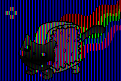

WebGL is an adaptation of the [OpenGL ES 2.0 Spec](https://www.khronos.org/opengles/) to JavaScript, and started off as a collaboration of the Khronos Group and Mozilla. OpenGL is a library designed from a collaboration of multiple companies as a means of finalizing the fundamental axioms of organizing rendering data, and establishing a pipeline for managing this data.

At its core, WebGL is a state machine that lets you tell it how and where it will draw triangles/points/lines, so it's your job as a engine developer to organize when and how the state of the application will change.

Everything begins with the `context`, the entry point to the WebGL State Machine.

## `gl` - The WebGL Context

You can think of a context as a namespace where we give draw calls, like `gl.drawArrays`, `gl.drawElements`. OpenGL is an **Imperative API**, that means you have to explicitly say what to draw.

A context has a number of default values already established for you, like a *default frame buffer* (otherwise it wouldn't display anything!), some default values for how draw calls *overlap each other* (should they overwrite, or blend?). You're able to extend these defaults at any step in the draw process.

```js
// First get a reference to a canvas element.
let canvas = document.createElement('canvas');

// Here's our context, normally denoted with
// the reference name `gl`.
let gl = canvas.getContext('webgl');
```

Note, that `canvas.getContext` has a number of other signatures and takes in a few optional parameters.

```ts
interface HTMLCanvasElement extends HTMLElement {

  // Pass 'webgl2' to get WebGL 2's features.
  getContext(contextId: "webgl2", contextAttributes?: WebGLContextAttributes): WebGL2RenderingContext | null;

  // Or pass 'webgl'/'experimental-webgl'.
  getContext(contextId: "webgl" | "experimental-webgl", contextAttributes?: WebGLContextAttributes): WebGLRenderingContext | null;

  //...

}

type WebGLContextAttributes = {
  failIfMajorPerformanceCaveat?: boolean;
  alpha?: boolean;
  depth?: boolean;
  stencil?: boolean;
  antialias?: boolean;
  premultipliedAlpha?: boolean;
  preserveDrawingBuffer?: boolean;
}
```

So if you have experience with imperative APIs like Canvas or Game Maker Studio's draw system, you'll feel right at home with *Raw WebGL*.

## Fundamentals - Biology, Physics and Mathematics



Our eyes only have 3 kinds of receptors for colored light, red, green, and blue. The engineers of colored monitors designed the pixel around the premise of how our eyes would interpret them, but really, a pixel is 3 lights, and a color is a mix of those 3 lights. An **image** is a *grid of colors*, and a **movie** is a *list of images*.

```glsl
// Colors can be described as a 32 bit int, with 8 bits representing each channel.
// The last channel being alpha.
// red - green - blue - alpha
uint purple = 0xff00ffff;

// They could also be described as vectors in glsl:
vec3 purplevec = vec3(1.0, 0.0, 1.0);
```

### Rasterization

There's two "worlds", the mathematical world of perfect quantities, and what the mediums we use to represent these quantities *can actually describe*, bound by the limitations of how many __bytes we can use to actually describe data__.

**Rasterization** is the process of converting shapes described by complex vectors into an image. It's handled by your GPU

**Bresenham's line algorithm** - An algorithm that creates a pixelated line from 2 points. This algorithm has been implemented in hardware by graphics cards as a way of creating triangles. A triangle is drawn as a series of lines sweeping down.

### Overlapping | Transparency, Depth, Effects

When you perform a draw call, they also run through an algorithm that handles what happens when two fragments overlap. This is **Depth Testing**:

```js
// The default function is when something has a smaller depth value, it overlays on top.
gl.depthFunc(gl.LESS);

// Enable testing to see if something is in front of something else.
gl.enable(gl.DEPTH_TEST);
```

But depth testing is a boolean operation, and triangles that are drawn after another triangle that don't pass the depth test will be *discarded*. If we want to blend two triangles on the same mesh to blend together, we'll need to specify a **Blend Function** and *turn off depth testing*.

```javascript
// Disable depth testing since we want our object to overlap on itself.
gl.disable(gl.DEPTH_TEST);

// Set the function that blends colors together.
gl.blendFunc(gl.SRC_ALPHA, gl.ONE);
gl.enable(gl.BLEND);

 // [ Draw your stuff here ]

 // Then reset the WebGL state to what it was.
 gl.disable(gl.BLEND);
 gl.enable(gl.DEPTH_TEST);
```

### Blend Functions

A **blend function** applies a function when two things render on top of each other, should they add, subtract, divide, mix?

It can get pretty hard to imagine, so [Anders Riggelsen](http://www.andersriggelsen.dk/glblendfunc.php) provided a great tool to experiment with every combination.

### Vertex Buffer Objects

**Vertex Buffer Objects** (or VBOs for short), are a data structure that describes vertex data. You could lay out the data for a 3D model any way you want in binary.

### Shaders

```glsl
void main() {

}
```

```glsl
void main() {

}
```

### Drawing triangles

WebGL provides a number of API calls to draw things, like triangles, lines and points.

```javascript
gl.drawArrays
gl.drawElements
```