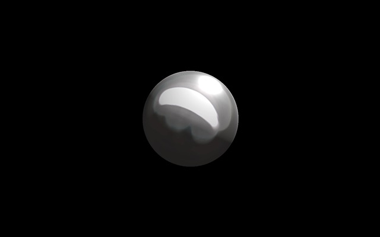
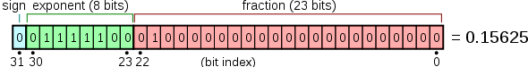
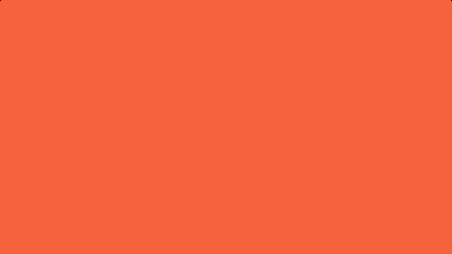
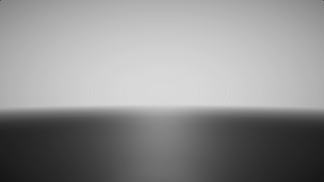
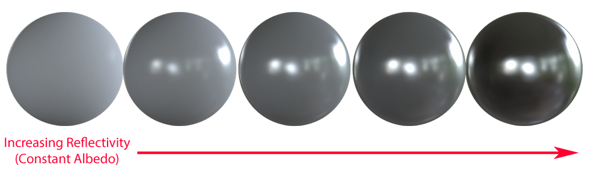

Whenever I think of Portal 2, there's a ton of amazing memories that come to mind, the science fair, Wheatley getting control of the facility, [Spaaaaaaaaaaaaaaaaaaaaaaaccee](https://youtu.be/xeKMS62GrTI). I wanted to make a shader that showcased one of my favorite scenes, the tractor beam leading to Wheatley.

Nothing is born from a vaccum, so it's thanks to all the resources posted by ShaderToy users like [iq](https://www.shadertoy.com/user/iq) and [mplanck](https://www.shadertoy.com/user/mplanck) that this was possible, a lot of the code here was forked from them, alteredaquila, the three.js team, unity's standard shaders.

 > Note: to view the shader at it's best settings, you'll have to set your browser to render on your dedicated gpu. This can be done in chrome with the latest Nvidia drivers by right clicking chrome > Run With Graphics Processor > Your GPU.

## Final Product

Here's the final program in action:

<iframe width="640" height="360" frameborder="0" src="https://www.shadertoy.com/embed/XlfXz2?gui=true&t=10&paused=true&muted=false" allowfullscreen></iframe>

## Shader Theory

Shadertoy requires that all shaders be created in glsl, so no other part of WebGL (Vertex Buffers, gl_lines, etc.) can be used. This isn't too much of a problem, as the community has been using realtime gpu raytracing (raymarching) as an alternative to triangles.

> "The idea: draw two triangles that cover the entire screen area, and invoke a pixel shader that will create an animated or static image." ~ Iñigo Quilez, [Rendering Worlds with Two Triangles with raytracing on the GPU](http://www.iquilezles.org/www/material/nvscene2008/rwwtt.pdf)

### Density Functions



The idea is that you can describe any volume as a density function, for example:

```glsl
float sphere( vec3 p, float r )
{
  return length(p) - r;
}
```

**p** is a domain of points in \(R^3\) space, and \(r\) is just the radius of a sphere. So say \(p\) is `vec3(0.0)`, and \(r\) is `1`., the function will return -1, but if \(p\) is say `vec3(4.0)` the returned value is greater than `0`. 

To translate the sphere, you just need to subtract \(p\) by a vec3 with the position you would like it to be.

By having density be defined as a floating point value instead of a bool, you can define a range of values to be whatever you want, in this case, all negative values are solid, all positive are empty (So using the sign bit behaves like a bool).



You can say, have the density function behave like a gas, where any value above 1 is solid, but any between 1 and zero can have different densities for say, clouds. This is used in [IQ's Clouds shader](https://www.shadertoy.com/view/XslGRr) as a means of changing the output color:

```glsl
vec4 integrate( in vec4 sum, in float dif, in float density, in vec3 bgcol, in float time )
{
  //Colors
  vec3 gray = vec3(0.65);
  vec3 lightgray = vec3(1.0,0.95,0.8);
  vec3 bluegray = vec3(0.65,0.68,0.7);
  vec3 orangegray =  vec3(0.7, 0.5, 0.3);

  //Density Colors
  vec4 col = vec4( mix( 1.15 * lightgray, gray, density ), density );
  vec3 lin =  (1.3 * bluegray) + (0.5 * orangegray * dif);
  col.xyz *= lin;
  col.xyz = mix( col.xyz, bgcol, 1.0 - exp(-0.003*time*time) );

  //Front to Back Blending
  col.a *= 0.4;
  col.rgb *= col.a;
  return sum + col*(1.0 - sum.a);
}
```

### Raymarching

**Raymarching** is a method of GPU raytracing, with the goal of trying to compute or estimate a lower bound of the distance to the closest surface at any point in space. It works like regular raycasting, but marching with smaller and smaller distances like an inverse function.

[](https://www.shadertoy.com/view/XtsXRB)

This gives room for optimization since you can change the iteration behavior, like using larger steps when distances are farther from the origin, clamping the step distance like a camera's near/far planes, lowering the step count, etc.

Here's an excerpt of code that does raymarching:

```glsl
#define DISTMARCH_STEPS 60
#define DISTMARCH_MAXDIST 50.

//Just like a camera has an origin and point it's looking at.
vec2 distmarch( vec3 rayOrigin, vec3 rayDestination, float maxd )
{
  //Camera Near
  float epsilon = 0.001;
  //Step Size
  float dist = 10. * epsilon;
  //Steps
  float t = 0.;
  //Materials behave like Color ID Maps, a range of values is a material.
  float material = 0.;

  //March
  for (int i = 0; i < DISTMARCH_STEPS; i++)
  {
    if ( abs(dist) < epsilon || t > maxd ) break;
    // advance the distance of the last lookup
    t += dist;
    vec2 dfresult = scenedf( rayOrigin + t * rayDestination );
    dist = dfresult.x;
    material = dfresult.y;
  }

  //Camera Far
  if( t > maxd ) material = -1.0;

  //So we return the ray's collision and the material on that collision.
  return vec2( t, material );
}
```

So raymarching behaves like a camera, so it's a good idea to have a camera system set up for it:

```glsl
//Globals
vec3  g_camPointAt = vec3(0.);
vec3  g_camOrigin = vec3(0.);

//Camera Data
struct CameraData
{
  vec3 origin;
  vec3 dir;
  vec2 st;
};

CameraData setupCamera(in vec2 fragCoord)
{

  // aspect ratio
  float invar = iResolution.y / iResolution.x;
  vec2 st = fragCoord.xy / iResolution.xy - .5;
  st.y *= invar;

  // calculate the ray origin and ray direction that represents
  // mapping the image plane towards the scene
  vec3 iu = vec3(0., 1., 0.);

  vec3 iz = normalize(g_camPointAt - g_camOrigin);
  vec3 ix = normalize(cross(iz, iu));
  vec3 iy = cross(ix, iz);

  vec3 dir = normalize(st.x*ix + st.y*iy + .7 * iz);

  return CameraData(g_camOrigin, dir, st);

}
```



The camera is built to be first person, and works by transforming the pointing vector with mouse uniforms.

```glsl
void animateCamera()
{
    camOrigin = vec3(0., 1.68, 0.);

    //Map click to [-.8, .8].
    vec2 click = iMouse.xy / iResolution.xx;
    click = 1.6 * click - .8;

    float yaw    =  PI_OVER_TWO * (click.x);

    camPointAt = camOrigin + vec3(cos(yaw), 0., sin(yaw) );
}
```

In main(), these functions are used as so:

```glsl
// Setup Camera
CameraData cam = setupCamera(fragCoord);

//Animate Camera
animateCamera();

// Scene Marching
vec2 scenemarch = distmarch(cam.origin, cam.dir, DISTMARCH_MAXDIST);
```

### PBR

**Physically Based Rendering** is a method of describing materials that decouples a material's behavior from it's color. A material's defined as:

- **Albedo** - base color.
- **Metallic** - How reflective a material is.
- **Roughness** - how rough a material is (Unreal calls this *roughness*, Unity calls this *smoothness*, others call it *gloss* or *microsurface*)





In this example I'm using PBR rendering to quickly design materials via this struct:

```glsl
struct SurfaceData
{
  vec3 point;
  vec3 normal;
  vec3 basecolor;
  float roughness;
  float metallic;
};
```

The materials are part of certain ranges:

```glsl
// MATERIAL DEFINES
#define POTATO_MATL 1.
#define REDPLASTIC_MATL 2.
#define YELLOWPLASTIC_MATL 3.
#define INITSURF(p, n) SurfaceData(p, n, vec3(0.), 0., 0.)

//inout means mutating surf
void material(float surfid, inout SurfaceData surf)
{
  vec3 surfcol = vec3(1.);
  if (surfid - .5 < SPHERE_MATL)
  {
    surf.basecolor = vec3(.8, .2, .5);
    surf.roughness = .5;
    surf.metallic = .8;
  }
  else if (surfid - .5 < REDPLASTIC_MATL)
  {
    surf.basecolor = vec3(0.);
    surf.roughness = 1.;
  }
  else if (surfid - .5 < YELLOWPLASTIC_MATL)
  {
    surf.basecolor = vec3(.02, .02, .05);
    surf.roughness = .2;
    surf.metallic = .0;
  }
}
```

In main() the function is used as so:

```glsl
vec3 mp = cam.origin + scenemarch.x * cam.dir;
vec3 mn = calcNormal(mp);
SurfaceData currSurf = INITSURF(mp, mn);
material(scenemarch.y, currSurf);
scenecol = shadeSurface(currSurf);
```

### Shadows and Ambient Occlusion

Shadows are raymarched the same as volumes, however the rayOrigin and Direction are the surface point and the light direction respectively.

```glsl
#define SOFTSHADOW_STEPS 40
#define SOFTSHADOW_STEPSIZE .1

float calcSoftShadow( vec3 rayOrigin, vec3 rayDirection, float mint, float maxt, float k )
{
  float shadow = 1.0;
  float t = mint;

  for( int i = 0; i < SOFTSHADOW_STEPS; i++ )
  {
    if( t < maxt )
    {
      float h = scenedf( rayOrigin + rayDirection * t ).x;
      shadow = min( shadow, k * h / t );
      t += SOFTSHADOW_STEPSIZE;
    }
  }
  return clamp( shadow, 0.0, 1.0 );

}
```

Ambient occlusion is calculated by sampling the density map of a scene around a given point, and just adding the relative distances.

```glsl
#define AO_NUMSAMPLES 6
#define AO_STEPSIZE .1
#define AO_STEPSCALE .4

float calcAO( vec3 p, vec3 n )
{
  float ao = 0.0;
  float aoscale = 1.0;

  for( int aoi=0; aoi< AO_NUMSAMPLES ; aoi++ )
  {
    float step = 0.01 + AO_STEPSIZE * float(aoi);
    vec3 aop =  n * step + p;

    float d = scenedf( aop ).x;
    ao += -(d-step) * aoscale;
    aoscale *= AO_STEPSCALE;
  }

  return clamp( ao, 0.0, 1.0 );
}
```

## Conclusion

Shaders can do some amazing things extremely efficiently, from volumetric rendering to advanced lighting techniques like PBR. Keep working and make something amazing!