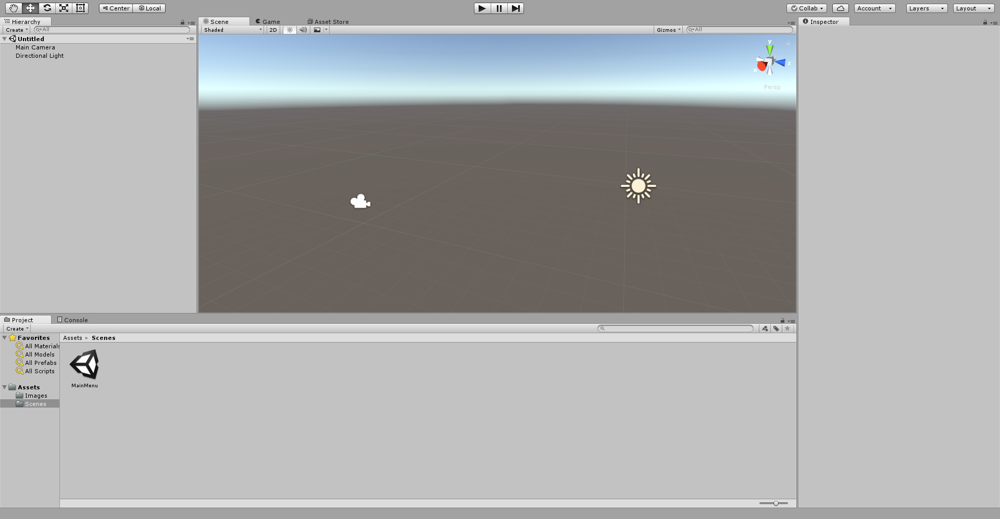

Unity is the most popular game engine in the world, used by large companies like Nintendo, Square Enix as well as many independent developers to quickly build cross platform games. 

## Editor Design



Each window is given it's own window and rendering context, similar to Unreal Engine, and are simply positioned atop one another by the main window's positioning system. 

Updates to the window depend on user interactions (Reactive model), otherwise it simply doesn't refresh rendering.

## C# Runtime

Unity follows a module singleton pattern for low level services like inputs.

```cs
/// <summary>
/// You can write your docs with XML.
/// </summary>
public class Controller : MonoBehavior {
  Update() {
      if (Input.GetKey(KeyCode.A)) {
        // Perform some action
      }
  }
}
```

### C# Code Style

- **NameSpaces/Classes/Enums/Structs/Functions** - CamelCase with the first character Capitalized.

- **Variables** - camelCase with first character lower cased.

- **Private** - camelCase with the first character as an underscore, the second lower cased, default behavior.


C# Lets you write XML for your docs

Unity projects are built with C# runtime which bundles the Unity's low level engine systems through easy to use function interfaces. C# saves the developer the hassle of managing memory 

serialization of your code to Unity UI objects

By default every class/enum you include in your project is available in the entire c# runtime, so it's your responsibility to alias modules through namespaces instead of `import` statements like JavaScript or Python.

Rust for example enforces a file based module system rather than letting you have the freedom of putting files wherever.

## File Hierarchy

Most projects in Unity organizes files by *Type*.

```bash
├─ Assets/
│   ├─ Scenes
│   ├─ Materials
│   ├─ Models
│   ├─ Prefabs
│   ├─ Scripts
│   └─ ...
├─ ProjectSettings/
│   └─ ...
└─ readme.md
```

With groups of Materials, Models, and Scripts often organized themselves loosely into Components.

```bash
├─ Assets/
│   ├─ DialogueSystem
│   ├─ ProceduralTrees
│   └─ ...
├─ ProjectSettings/
│   └─ ...
└─ readme.md
```


## Data Model

Unity stores data as serialized files

Meta information links files in a hash data structure

State is stored as prefabs/Scenes

Classes that inherit from `MonoBehavior` handle controller logic

## Renderer

Mesh ref

Mesh Renderer 

n Material to 1 Shader

Shaders written in HLSL

HLSL to GLSL compiler

## Resources

To put as much effort into learning Unity as possible, you'll want to become a part of the community:

### People

- [Keijiro Takahashi](https://github.com/keijiro) - Unity Japan, is constantly working on interesting bite sized projects.
- [Seiya Ishibashi](https://github.com/i-saint) - Unity Japan, working on integrations with various APIs and systems like Pixar.

### Discussion

- [r/unity3d](https://reddit.com/r/unity3d)
